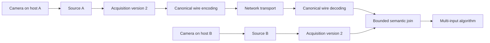

\page page_acquisition_metadata Acquisition identity and multi-host timing

# Acquisition identity and multi-host timing

## Status and authority

This document defines the PipeWireAO acquisition identity, timing, wire, and
join contract. It applies to complete frames and to complete row-block ndarray
micro-buffers. It does not make the PipeWire scheduler a semantic join engine.

The key words **MUST**, **MUST NOT**, **REQUIRED**, **SHALL**, **SHALL NOT**,
**SHOULD**, **SHOULD NOT**, **RECOMMENDED**, **NOT RECOMMENDED**, **MAY**, and
**OPTIONAL** in this document are to be interpreted as described in BCP 14
(RFC 2119 and RFC 8174) when, and only when, they appear in all capitals.

`spa/include/spa/buffer/meta.h` is the ABI authority. This document is the
semantic authority. A transport profile may define how the canonical wire
record is carried, but it MUST NOT change these field meanings.

## System boundary

PipeWire graph scheduling answers when a runnable node may process. It does not
decide whether buffers from independent cameras describe the same physical
acquisition. That decision belongs to a bounded semantic join.



The same contract applies when both sources are local; the encode, transport,
and decode steps are then absent.

## Identity contract

The acquisition identity is the exact tuple:

```text
(domain, generation, sequence)
```

- `domain` is a nonzero, opaque 128-bit identifier for one acquisition or
  trigger authority.
- `generation` is a 64-bit epoch assigned by that authority.
- `sequence` is the 64-bit acquisition number within that generation.

**ACQ-ID-001:** Producers that claim a shared identity domain **MUST** receive
`domain` and `generation` from the same control-plane authority and **MUST**
derive `sequence` from the same physical trigger or acquisition counter.

Verification: configure two simulated hosts with the same authority values and
prove that equal physical acquisitions compare equal while a changed domain,
generation, or sequence compares unequal.

**ACQ-ID-002:** A producer **MUST NOT** advance a shared generation because of
its own pause, restart, packet loss, or local process lifecycle. Before a
sequence can reset, wrap, or be reused, the authority **MUST** distribute a new
generation to every participant. If the producer observes a non-increasing
sequence without that reconfiguration, it **MUST** fail closed and stop
publishing valid identity.

Verification: inject a duplicate or reset sequence and prove that the producer
does not publish a new locally invented identity tuple.

Exact identity is independent of clock synchronization and is the preferred
join key. A PTP timestamp is a fallback for sources without a common hardware
counter and a consistency check for sources that have one.

## Metadata versions

`SPA_META_Acquisition` keeps a 96-byte, 8-byte-aligned allocation in both
versions.

| Version | Exposure time | Cross-host use |
| --- | --- | --- |
| 1 | Host-local `CLOCK_MONOTONIC` nanoseconds | Never comparable across hosts |
| 2 | Explicit `MONOTONIC` or `TAI` timebase | Comparable only with valid matching PTP provenance |

Version 2 reuses Version 1 reserved storage without changing allocation size.
Version-aware readers accept both versions. A Version 2 producer and consumer
negotiate `SPA_META_FEATURE_ACQUISITION_VERSION_2`; an older Version 1 reader
must not silently receive Version 2 metadata.

**ACQ-ABI-001:** A producer **MUST** initialize every reused allocation with
`spa_meta_acquisition_init()` before setting fields. A consumer **MUST** call
`spa_meta_acquisition_is_valid()` before interpreting a mapped value.

Verification: ABI tests check size, alignment, field offsets, reserved bytes,
version negotiation, malformed records, and Version 1 read compatibility.

## PTP-qualified time

A cross-host exposure timestamp has all of these properties:

- `exposure_start_nsec` is the physical exposure start expressed as
  nonnegative Linux `CLOCK_TAI` nanoseconds;
- `timebase` is `SPA_META_ACQUISITION_TIMEBASE_TAI`;
- `PTP_REFERENCE_VALID` and `EXPOSURE_START_VALID` are set;
- `ptp_grandmaster_id` is the nonzero IEEE 1588 grandmaster clock identity;
- `ptp_domain_number` is the IEEE 1588 domain number; and
- `timestamp_uncertainty_nsec` is a conservative inclusive error bound.

**ACQ-TIME-001:** A producer **MUST** use
`spa_meta_acquisition_set_exposure_start_ptp()` only when the device timestamp
is traceably mapped to `CLOCK_TAI`. The mapping **MUST** account for the PTP
timescale and UTC offset. A disciplined `CLOCK_MONOTONIC`, host arrival time,
buffer completion time, or unqualified device tick is not a substitute.

Verification: compare the reported exposure time against a qualified hardware
timestamp source while exercising the configured PTP profile.

**ACQ-TIME-002:** `timestamp_uncertainty_nsec` **MUST** bound device timestamp
resolution, exposure-latch error, device-to-PHC conversion error, PHC-to-TAI
correlation error, and the accepted synchronization error. If no defensible
bound is available, the producer **MUST NOT** set `PTP_REFERENCE_VALID`.

Verification: measure each error term or obtain a guaranteed bound, record the
sum used by the producer, and test the bound during steady state and recovery.

**ACQ-TIME-003:** After loss of synchronization, an unbounded clock step, an
unknown UTC offset, or an unqualified grandmaster change, the producer **MUST**
stop publishing PTP-valid time and **SHOULD** mark the next recovered output
`SPA_META_HEADER_FLAG_DISCONT`.

Verification: inject each loss condition and prove that no PTP-valid record is
published until qualification recovers.

Two Version 2 timestamps are comparable only when both records validate, both
are PTP-qualified TAI values, and their grandmaster identities and PTP domain
numbers are byte-for-byte equal. The helper
`spa_meta_acquisition_time_difference()` enforces these preconditions and
returns:

```text
difference = exposure_start_a - exposure_start_b
combined_uncertainty = saturating_add(uncertainty_a, uncertainty_b)
```

Host location, clock servo name, and similar wall-clock readings are not part
of the comparison.

## Join contract

**ACQ-JOIN-001:** A join **SHOULD** match an exact acquisition identity first.
It **MAY** use PTP time when identity is absent, or use it to reject an
identity match that violates a configured physical-time bound.

**ACQ-JOIN-002:** A time-based join **MUST** choose an application-specific
additional tolerance `T` and may match only when:

```text
abs(difference) <= combined_uncertainty + T
```

The addition is saturating. `spa_meta_acquisition_times_match()` implements
this test. `T` does not replace the reported uncertainty and **SHOULD** be less
than half the minimum acquisition interval so adjacent acquisitions cannot
match under nominal conditions.

**ACQ-JOIN-003:** A join **MUST** have bounded per-input storage, a deadline,
and an explicit policy for missing, late, duplicate, and ambiguous inputs. The
policy may drop, hold the last value, or emit an incomplete result, but a
non-real-time input **MUST NOT** retain an unbounded number of RTC buffers.

Verification: cover exact matches, different identity fields, matching and
different PTP authorities, the uncertainty boundary, adjacent acquisitions,
duplicates, missing inputs, reordering, deadline release, and overload.

## Canonical wire record

SPA metadata is native shared-memory state and is not automatically serialized
by RTP, AVB, or another network transport. Version 2 therefore defines a
canonical 96-byte wire record. Integers are unsigned big-endian values, except
that `exposure_start_nsec` uses its signed 64-bit two's-complement bit pattern.
Byte arrays are copied unchanged.

| Offset | Size | Field |
| ---: | ---: | --- |
| 0 | 4 | version |
| 4 | 4 | ABI size |
| 8 | 4 | flags |
| 12 | 4 | timebase |
| 16 | 16 | acquisition domain |
| 32 | 8 | generation |
| 40 | 8 | sequence |
| 48 | 8 | exposure start |
| 56 | 8 | exposure duration |
| 64 | 8 | timestamp uncertainty |
| 72 | 8 | PTP grandmaster identity |
| 80 | 1 | PTP domain number |
| 81 | 15 | zero, reserved |

`spa_meta_acquisition_serialize()` and
`spa_meta_acquisition_deserialize()` are the authoritative codecs. They accept
only Version 2 and reject nonzero reserved bytes or invalid field
combinations.

**ACQ-WIRE-001:** A cross-host adapter **MUST** carry one canonical record with
the corresponding payload and **MUST** preserve their association through
loss, reordering, duplication, and fragmentation. It **MUST NOT** copy the
native C structure directly onto the wire.

**ACQ-WIRE-002:** A receiving adapter **MUST** decode and validate the record
before publishing local `SPA_META_Acquisition`. Invalid or missing records
**MUST NOT** be synthesized from packet arrival time.

Verification: perform golden-vector and round-trip tests on both endian
architectures where available, then exercise loss, reordering, duplication,
and malformed records in the selected transport profile.

## eGrabber status

The eGrabber source can derive exact identity from a configured nonzero
acquisition domain, externally assigned generation, and qualified vendor event
context. It retains the last observed sequence across Pause and Start and
fails processing on a duplicate or reset sequence. A control plane must
recreate or reconfigure the source with a new shared generation before a
counter namespace can reset or be reused.

The current eGrabber timestamp mapper produces host-local header presentation
timestamps. It does not yet establish a hardware-qualified PTP exposure-start
mapping and therefore does not set the Version 2 PTP fields.

## Capability and qualification status

| Capability | Status |
| --- | --- |
| Version 1 compatibility and Version 2 ABI validation | Implemented and unit-tested |
| PTP authority comparison and uncertainty matching | Implemented and unit-tested |
| Canonical Version 2 wire codec | Implemented and unit-tested |
| eGrabber shared-generation fail-closed behavior | Implemented and unit-tested |
| Hardware-qualified eGrabber PTP exposure timestamp | Not implemented or qualified |
| RTP, AVB, or other network carriage profile | Not implemented or qualified |
| Application-specific bounded multi-input join | Required in the consuming algorithm or join node |

The current requirement evidence is:

| Requirement | Implementation or verification evidence |
| --- | --- |
| ACQ-ID-001 | Exact tuple validation and equality tests in `test/test-spa-buffer.c` |
| ACQ-ID-002 | eGrabber non-increasing sequence tests in `test-acquisition-key.cpp` |
| ACQ-ABI-001 | C ABI, validation, export, and negotiation tests plus Rust wrapper tests |
| ACQ-TIME-001 through ACQ-TIME-003 | Contract defined; hardware producer qualification remains open |
| ACQ-JOIN-001 and ACQ-JOIN-002 | Identity and PTP comparison helpers with boundary tests in C and Rust |
| ACQ-JOIN-003 | Contract defined; consuming join implementation and overload tests remain open |
| ACQ-WIRE-001 and ACQ-WIRE-002 | Canonical C codec, exported-symbol checks, malformed-record tests, and Rust round trip |

The implemented capabilities make the contract executable and prevent false
cross-host matches. A deployment may claim operational multi-host joins only
after its timestamp producer, network carriage, and join policy pass the
corresponding verification obligations above.
