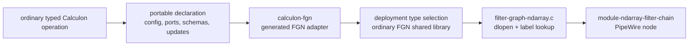

\page page_filter_graph_ndarray Filter Graph Ndarray proof of concept

# Filter Graph Ndarray proof of concept

Status: active proof-of-concept contract

Review date: 2026-08-25

## Scope

The proof of concept implements a synchronous graph of typed ndarray plugins.
The graph host is C. Plugin libraries may be implemented in C, Rust, or another
language that can export the versioned C ABI in
`spa/filter-graph/ndarray-plugin.h`.

The proof of concept establishes the plugin ABI, loader, graph validation,
intermediate buffer ownership, typed property routing, synchronous graph
execution, and a `pw_filter` adapter. The adapter exposes the composite as one
PipeWire node and translates external graph ports to ordinary SPA ndarray
Format, Buffers, and Meta parameters.

## Vocabulary

FGN follows PipeWire filter-chain terminology wherever the two graph hosts
share a concept:

- A **plugin library** exports one `spa_fgn_plugin` descriptor registry.
- A **descriptor** is selected by the configured node `label` and describes
  one loadable plugin.
- An **instance** is constructed from that descriptor and owns plugin state.
- A graph contains **nodes**, **ports**, and **links**. Each node owns one
  plugin instance.
- A **property** is a typed low-rate value exposed through `SPA_PARAM_PropInfo`
  and `SPA_PARAM_Props`. The node `props` object supplies initial runtime
  property values. This differs deliberately from the audio filter chain's
  `control` object because FGN values are typed properties, not control ports.
- A **parameter port** carries a sparse large ndarray update. It is not a
  scalar property or a per-frame data port.
- A Calculon **algorithm** and its **plan** remain scientific-layer concepts.
  The FGN adapter exposes an algorithm as a plugin without renaming the
  scientific contract.

The terms algorithm, plugin library, descriptor, instance, and node are not
interchangeable at the FGN boundary. A filter is a graph role, while an
operation remains a mathematical or scientific action inside an algorithm.

## Normative contract

This document and `spa/filter-graph/ndarray-plugin.h` are the normative
authorities for the FGN ABI and graph host. Uppercase requirement terms use the
meanings defined by BCP 14 (RFC 2119 and RFC 8174). There is no admitted
latency target yet; real-time requirements below constrain mechanism and
steady-state allocation rather than claiming a percentile latency.
Implementation and verification status is maintained in
`filter-graph-ndarray-traceability.toml` beside this document.

### FGN-ABI-001 — Versioned C boundary

A plugin library MUST expose the exact ABI version requested by the host and
use only the declared C-layout structures, fixed-width scalar fields, pointers,
and callbacks across the shared-library boundary. Descriptors, port arrays,
formats, shapes, descriptor strings, property descriptors, choices, and their
strings remain valid until instance cleanup or library unload as documented in
the public header. A plugin whose immutable registry or language runtime has
process lifetime MUST set `SPA_FGN_PLUGIN_FLAG_RETAIN_LIBRARY`. The host MUST
then keep that library mapped until process termination. Such a plugin MUST
bound retained registry state per mapped library, not per graph or instance.

### FGN-FORMAT-001 — Exact per-port ndarray meaning

Each port format MUST identify its element type, packed layout, positive exact
shape, optional rate, and optional versioned scientific schema. Graph creation
MUST compare all present fields exactly and reject a link whose schemas differ.
The ABI and graph configuration MUST NOT add a node-wide interpretation
profile: a node can transform between different scientific meanings, and one
free-form string cannot identify every port. A future coordinate-basis or
calibration identity requires a separately specified per-port field with
defined lifecycle and parameter-update semantics.

Verification intent: inspect the ABI layout, accept equal schemas, reject an
otherwise identical link with different schemas, and reject the retired
`profile` configuration key in C and generated Rust plugins.

### FGN-CONFIG-001 — Construction configuration boundary

A node `config` value MUST be an object in PipeWire's relaxed SPA JSON syntax.
Before `instantiate()`, the graph host MUST recursively canonicalize that
object to standard JSON, including quoted keys and strings, colons, and
commas. A missing `config` value MUST be passed as the standard JSON object
`{}`. Construction-only and graph-rebuild values MUST travel through this
pre-instantiation configuration boundary; the initial node `props` object MUST
NOT be used for either class.

### FGN-LIFE-001 — Callback concurrency and ownership

The host and plugin MUST follow this callback matrix:

| Callback family | Calling context | May overlap `process()` | Borrowed data lifetime |
|---|---|---:|---|
| instantiate, cleanup | serial lifecycle owner | no | config only for instantiate call |
| port and property enumeration | serial admission owner | no | returned descriptor storage lives with instance |
| get property | serial control owner | yes | returned string through callback return and immediate POD copy |
| prepare properties | serial control owner | yes | assignments and strings only for prepare call |
| commit properties | data-loop owner at graph-cycle start | no node processing has begun | prepared object transfers to plugin |
| discard properties | serial control owner | yes | prepared object consumed by callback |
| prepare/discard parameter or parameter set | serial parameter owner | yes | input buffers only for prepare call |
| commit parameter | serial parameter owner, or data-loop owner for a graph transaction | legacy serial commit may overlap | prepared object transfers to plugin |
| adopt parameter set | data-loop owner at graph-cycle start | no node processing has begun | none |
| activate, deactivate, reset | serial lifecycle owner | no | no retained host data |
| property revision | control and data-loop observers | yes | none |
| process | data-loop owner | one data-loop caller | buffers only for process call |

A plugin copies any string, buffer content, or other borrowed input retained
after its callback returns. The host serializes control callbacks with one
another but does not lock the data loop; every control/data publication
therefore uses an explicit release/acquire or stronger protocol.

### FGN-BUF-001 — Buffer admission and completion

Before invoking a plugin, the host MUST admit exactly one data plane per
connected buffer, verify offset and extent arithmetic against `maxsize`, verify
element and known-metadata alignment, reject duplicate metadata types, and
reject overlap among data, chunk, metadata, input, and mutable output regions.
Mutable output regions MUST also be disjoint from the caller's outer input and
output pointer arrays and from every graph-owned plugin-facing buffer array.
The admitted limits permit at most 16 metadata entries and 4096 total
metadata bytes per buffer. A plugin MUST preserve the supplied output offset,
leave output size zero until processing succeeds, publish the exact completed
size only after success, and leave size zero on failure.

Verification intent: exercise nonzero output offsets, shared descriptors with
shifted chunks, misaligned data, excessive and duplicate metadata, metadata
aliasing, and a plugin failure after output admission.

### FGN-SCHEMA-001 — Descriptor admission

The graph host MUST reject a plugin descriptor surface before activation when
IDs or names are duplicated, required names/descriptions/units are empty, a
descriptor, port, or property local name exceeds 255 UTF-8 bytes, flags are
unknown or contradictory, scalar kinds disagree, a range is unsupported or
invalid, a default violates its constraint, or choice names or values are duplicated.
The name limit keeps configured and namespaced lookup lossless. Boolean and
string descriptors do not use ordered ranges. One graph admits at most 1024
nodes, 4096 links, and 1024 external ports per direction. One node admits at
most 1024 ports and 4096 properties; one property admits at most 1024 choices,
and one transaction admits at most 4096 assignments per node.

### FGN-PROP-001 — Failure-atomic preparation

`spa_fgn_graph_set_props()` MUST parse its complete namespaced Props structure,
and an initial node `props` object MUST parse its complete local property
object. Both paths reject malformed/trailing/duplicate/unknown/non-runtime
values and prepare every affected plugin instance before publishing any of
them. A preparation failure discards every prepared object and leaves the
active and pending graph transaction unchanged.

### FGN-PROP-002 — Graph-cycle publication

One successfully prepared non-empty graph property transaction MUST occupy a
bounded pending slot and return `-EBUSY` while that slot or its unreclaimed
retired transaction is unavailable. At the beginning of one later graph cycle,
the data-loop owner publishes every affected plugin instance before processing
any node, so one cycle cannot observe a transaction on only a subset of its
affected nodes. An empty transaction succeeds without occupying the slot.
Initial runtime properties MUST be prepared by the admission owner into this
same bounded pending transaction and committed at the first process boundary.
The admission owner MUST NOT call `commit_props()` directly.

### FGN-PROP-003 — Prepared-object lifetime

A plugin `prepare_props()` callback MUST return a self-contained prepared
object or an error and copy every string it retains. `commit_props()` consumes
that object without failure, allocation, blocking, destruction, or unwinding;
`discard_props()` consumes an unpublished object on the control path.

### FGN-PROP-004 — Property observation

The host MUST validate the type and descriptor constraint of every value
returned by `get_prop()` before building `SPA_PARAM_Props`. A plugin brackets
an externally visible change by advancing a monotonic 64-bit revision from an
even stable value to odd for the complete duration of every observable
mutation and then to a greater even value. Overlapping writers MUST keep the
revision odd until all writers complete. The graph rejects an
odd or changed control snapshot, reports one bounded process change flag, and
the PipeWire adapter retries and publishes the snapshot outside the data loop.

### FGN-PARAM-001 — Failure-atomic ndarray parameter preparation

`spa_fgn_graph_set_parameters()` MUST accept a non-empty bounded set of unique
external parameter input ports, validate every buffer before scientific
preparation, group assignments by plugin instance, and invoke each affected
instance's `prepare_parameters()` callback exactly once. One local callback
MUST compose all of its assignments into one complete private replacement.
The host MUST prepare every affected instance before publishing any of them.
If validation or preparation fails, it MUST discard every prepared token and
leave active and requested plans unchanged.

`spa_fgn_graph_update_parameter()` MUST use this transaction path when the
descriptor exposes the batch callbacks. Descriptors without those callbacks
MAY retain the legacy single-parameter publication behavior. One transaction
admits at most 4096 assignments.

Verification intent: replace two calibration planes on one node without an
observable mixed plane, reject duplicate ports and inconsistent scientific
preparation, and discard an already prepared first node when a later node
rejects its assignment.

### FGN-PARAM-002 — Graph-cycle ndarray parameter publication

One successfully prepared graph parameter transaction MUST occupy one bounded
pending graph slot and return `-EBUSY` while that slot or its unreclaimed
retired transaction is unavailable. At one later graph-cycle start, the data
loop MUST publish every affected instance and then invoke every affected
instance's `adopt_parameters()` callback before processing any node. Commit
and adoption MUST be bounded, non-failing, allocation-free, lock-free,
destruction-free, syscall-free, and unwind-contained. Prepared and retired
tokens MUST be destroyed only on the serial control path.

This guarantee is a coherent graph-cycle plan change. It does not roll back
algorithm state if numerical processing later fails.

Verification intent: update parameters on two linked nodes, verify that the
next output uses both replacements, observe deterministic backpressure, and
verify that a failed multi-node preparation preserves both active plans.

### FGN-EXEC-001 — Synchronous single-rate acyclic execution

One graph process call MUST execute one complete quantum on every node in
topological order. The host MUST reject a directed cycle. Every specified
port rate in one graph MUST use the same exact numerator and denominator; the
host MUST reject mixed specified rates, and MUST NOT imply resampling,
decimation, interpolation, or a multi-rate schedule.

A feedback decomposition therefore requires an explicit unit-delay operation
with specified initial value, state, metadata, reset, and failure behavior.
No such operation is admitted in this proof of concept. A scientific
operation that requires feedback MUST remain atomic until that operation and
its equivalence evidence exist.

Verification intent: reject a two-node cycle and a graph containing two
different specified rates, while admitting and executing an equal-rate DAG.

### FGN-FAIL-001 — Processing failure and rollback boundary

The host MUST validate the complete external buffer set before invoking any
plugin. If a plugin fails after graph execution begins, the host MUST leave
every external output size zero. The host does not roll back workspaces,
internal buffers, or state already changed by earlier plugin callbacks in that
cycle. A decomposition whose scientific contract requires whole-operation
rollback MUST remain one atomic algorithm or add a separately specified
prepare/commit/abort processing protocol before replacing it.

Verification intent: verify pre-callback buffer rejection and zero external
output sizes after a numerical failure; inspect stateful decompositions and
retain fused implementations wherever rollback equivalence is required.

### FGN-RT-001 — Repeated graph path

`spa_fgn_graph_process()`, graph-transaction publication, property-revision
sampling, and plugin-instance `process()` callbacks MUST perform bounded work
without allocation, blocking, locks, system calls, reference-count destruction,
or unwinding. Graph construction, parsing, validation, preparation, and retired
object reclamation remain off the repeated path. This syscall-free boundary is
the FGN graph and plugin-instance path, not the outer PipeWire module notification:
that adapter MAY issue one coalesced event-source wake-up after construction,
but MUST NOT use a dynamically growing generic invoke queue from its data-loop
callback.

### FGN-PORT-001 — Ndarray role separation

The ABI MUST represent per-frame values as ordinary data ports, sparse large
prepared artifacts as parameter input ports, and low-rate scalars as
properties. A parameter update copies or prepares retained plugin state before
publication and returns `-EBUSY` rather than growing an unbounded queue.
A valid graph MAY expose zero external inputs or zero external outputs for a
pure source or sink. The graph and PipeWire adapter MUST NOT depend on the
implementation-defined return value of a zero-size allocation, and graph
processing MUST accept a null external pointer array exactly when its count is
zero.

### FGN-SPA-001 — Standard parameter projection

The PipeWire adapter MUST expose runtime scalar values through standard
`SPA_PARAM_PropInfo` and `SPA_PARAM_Props` while documenting that this view
does not preserve canonical units, local IDs, or distinct read-only,
construction-only, and graph-rebuild classes. The plugin ABI remains the
complete descriptor authority.

### FGN-RUST-001 — Rust adaptation contract

A Rust `PluginInstance` MUST be `Send + Sync`, use an unsafe extension contract
for handwritten callback implementations, prevent unwinding across every C
callback, keep Rust-only layouts and allocator-owned handles behind an opaque
instance pointer, and use a panic-free, allocation-free processing
implementation. Adapter-owned `UnsafeCell` workspaces MUST document and
enforce the single-data-owner rule. The delivered build configuration and tests
must establish ABI layout, callback containment, and warmed processing behavior
for each admitted plugin.

## Configuration

The graph uses the same relaxed JSON/config syntax as PipeWire's existing
filter chain:

```text
{
    nodes = [
        {
            type = ndarray
            name = calibration
            plugin = "/usr/lib/pipewire-ao/filter-graph/libcalculon-fgn.so"
            label = pixel-calibration
            config = {
                detector-width = 320
                row-block-rows = 16
            }
            props = {
                "flat-sequence" = 42
            }
        }
        {
            type = ndarray
            name = slopes
            plugin = "/usr/lib/pipewire-ao/filter-graph/libcalculon-fgn.so"
            label = shack-hartmann
            config = {
                subapertures = 64
            }
        }
    ]
    links = [
        { output = "calibration:out" input = "slopes:pixels" }
    ]
    inputs = [ "calibration:in" "slopes:reconstructor" ]
    outputs = [ "slopes:slopes" "slopes:flux" ]
}
```

`plugin` is passed to `dlopen()` and `label` selects a descriptor exported by
that library. Every port supplies one exact element type, shape, layout,
optional rate, and schema after instance construction. Graph creation
rejects incompatible links, directed cycles, and mixed specified port rates
before activation.

The graph host converts each relaxed `config` object to standard JSON before
calling the plugin. Plugin authors can therefore use ordinary typed JSON
decoders and do not need to implement PipeWire's relaxed syntax. The separate
`props` object accepts runtime properties only and is prepared during graph
admission for adoption at the first process boundary.

The graph can be loaded with standard PipeWire tools. For example:

```text
pw-cli load-module libpipewire-module-ndarray-filter-chain '{
    node.name = ao-composite
    filter.graph = {
        nodes = [
            {
                type = ndarray
                name = calibration
                plugin = "/usr/lib/pipewire-ao/filter-graph/libcalculon-fgn.so"
                label = pixel-calibration
                config = { detector-width = 320 }
            }
        ]
    }
}'
```

External graph inputs and outputs become ports named `node:port`. Parameter
inputs also set the standard `port.control = true` property.

### Loading the current Calculon plugins

No Calculon-specific C loader is required by the current implementation.
`calculon-fgn` derives descriptors and callbacks directly from portable
Calculon algorithm declarations. A deployment bundle selects declaration
types but repeats no configuration, port, shape, schema, property, parameter,
or callback facts. The proof library directly exports
`spa_filter_graph_ndarray_plugin_get_interface`.

The current loading path is:



Build the proof library in the Calculon repository with:

```sh
RUSTFLAGS='-C link-arg=-Wl,--exclude-libs,ALL' \
  cargo build --release --locked -p calculon-fgn --features oxiblas \
  --example calculon-fgn-declaration-fixture
```

Then point an ndarray node at that shared library and select one descriptor by
label:

```text
{
    type = ndarray
    name = integrator
    plugin = "/path/to/libcalculon_fgn_declaration_fixture.so"
    label = leaky-integrator-f32
    config = {
        extent = 277
        initial_state = 0.0
        input_schema = "org.calculon.ao.controller-residual-error/1"
        output_schema = "org.calculon.ao.controller-command/1"
        rate = [ 1000 1 ]
    }
    props = { gain = 0.25 pole = 0.9 }
}
```

For this node, the graph host opens the library, resolves the generic FGN
entry point, requests the supported ABI version, finds the
`leaky-integrator-f32` descriptor, and instantiates it. Port discovery,
property transactions, parameter updates, and processing then use only the
FGN ABI. The host neither knows nor needs to know that the implementation was
generated from a Calculon algorithm.

The declaration proof library selects all 36 current production Rust
declarations. Selection is a deployment type list; descriptor facts remain
owned by the declarations beside the scientific implementations. A smaller
REVOLT fixture selects only the eight declarations used by its SHWFS and
deformable-mirror direct-call tests.
The reference SHWFS controller is this synchronous graph:

```text
calibrated image -> image-backed Shack-Hartmann -> reconstruction
                 -> leaky integrator -> PDM command
```

Region origins, detector coordinates, reference slopes, threshold pairs,
active subapertures, and the reconstruction matrix have typed sparse ndarray
parameter ports. The C graph-host proof checks construction, formats,
properties, metadata, standard rate projection, parameter adoption,
and the four-node result. A separate REVOLT-scale benchmark uses a 352 by 352
detector, 512 slopes, and 277 actuators.

The same generated REVOLT library can expose the deformable-mirror boundary as
five nodes: controller-to-VDM, VDM-to-PDM, atomic PDM command conditioning,
PDM-feedback-to-VDM, and VDM-feedback-to-controller. Six sparse matrix
parameter ports carry the projections; frame vectors remain data ports. The C
host proves this acyclic path at 277 actuators. It does not close the feedback
cycle or replace Calculon's fused deformable-mirror operation. That replacement
requires an explicit unit delay and whole-operation rollback semantics that
the current synchronous graph does not provide.

## Processing and ownership

The host allocates fixed intermediate `spa_buffer` storage when it constructs
the graph. Each plugin instance receives arrays of `spa_fgn_buffer`, which pair
the ordinary `spa_buffer` with its exact ndarray format. An instance may inspect
standard SPA data, chunk, Header, and Acquisition structures directly.

`process()` handles exactly one complete buffer quantum. It must not allocate,
block, retain or modify an input buffer, or unwind across the ABI. The host
executes nodes in topological order on the caller's data-loop thread. No
scheduler boundary exists between nodes in the composite. Input and
output structural, metadata, and data regions are distinct; an adapter rejects
overlapping regions before constructing language-level borrowed views. A
plugin instance writes at the supplied output chunk offset, preserves it, keeps
the completed size zero until success, and explicitly propagates any input
metadata required by its output contract.

## Properties

Plugin descriptors enumerate local scalar property information. The host
exports it as standard `SPA_PARAM_PropInfo` and `SPA_PARAM_Props`, qualifying
each name with its configured instance name:

```text
controller:loop-gain
controller:active-loop-gain
controller:requested-generation
controller:active-generation
```

ABI version 4 describes stable local IDs and names, Bool, Int, Long, Float,
Double, Id, and String values, defaults, descriptions, canonical units, ranges,
and enumerated choices. Every property has exactly one update class:

| Update class | Initial node `props` | Runtime `SPA_PARAM_Props` |
|---|---|---|
| read-only | no | no |
| runtime | yes | yes |
| construction-only | no; use `config` | no |
| graph-rebuild | no; use `config` and rebuild | no; the adapter must rebuild the graph |

Ranges and choice sets are mutually exclusive. The graph validates descriptor
metadata and every incoming value before it calls a plugin. Enum choices become
standard SPA enum choices and label pairs. SPA PropInfo has no unit field, so
the canonical unit remains available at the plugin ABI but is not preserved
as machine-readable metadata in the standard PipeWire parameter view.

A property update is a two-phase graph transaction. The host validates and
prepares every affected plugin instance first. It commits none if any preparation
fails. A successful non-empty transaction occupies one graph-owned pending
slot. At the start of a later graph cycle, the data loop invokes every commit
callback before it processes any node. Each affected instance therefore sees
the update at its process boundary in the same graph cycle. Commit callbacks
use preallocated plugin storage and do not allocate or destroy prepared state.

The graph returns `-EBUSY` while the pending transaction or its control-path
reclamation slot is occupied. Individual plugins may apply a tighter bounded
capacity. Requested and active generations are monotonic and independently
observable; an empty graph transaction is a no-op and advances neither.

A plugin instance may expose a monotonic property revision as an even/odd sequence
counter. The revision remains odd while one or more writers change observable
state and advances to a greater even value after the final writer completes.
The graph rejects a control snapshot
that sees an odd or changed revision, and samples the counter around
`process()`. It returns
`SPA_FGN_PROCESS_RESULT_PROPS_CHANGED` when externally visible values changed.
The PipeWire adapter schedules the property snapshot on the main loop; the data
loop never calls an external notification callback. Per-frame measurements and
validity still belong in ndarray outputs or metadata rather than properties.

Large matrices and prepared artifacts are ndarray buffers or plugin-owned
prepared state. They are not property values.

C plugins can declare descriptors as a static table. The initializer and
enumeration helpers in `spa/filter-graph/ndarray-plugin.h` keep SPA type tags,
structure sizes, and table iteration out of the callback body:

```c
static const struct spa_fgn_property_info properties[] = {
    SPA_FGN_PROPERTY_INFO_INIT(
        PROPERTY_GAIN,
        SPA_FGN_PROPERTY_FLAG_RUNTIME | SPA_FGN_PROPERTY_FLAG_RANGE,
        "gain", "Scalar gain", "1",
        SPA_FGN_VALUE_FLOAT_INIT(1.0f),
        SPA_FGN_VALUE_FLOAT_INIT(0.0f),
        SPA_FGN_VALUE_FLOAT_INIT(2.0f), 0, NULL),
};

return spa_fgn_enum_prop_info_table(properties,
        SPA_N_ELEMENTS(properties), index, info);
```

The plugin still owns its current-value mapping, replacement state, and
lock-free publication strategy. Those parts depend on the concrete C state
representation and cannot be inferred safely by the ABI.

## Large parameter ports

Reconstructors, calibration matrices, masks, reference vectors, and similarly
large state use sparse ndarray input ports marked
`SPA_FGN_PORT_FLAG_PARAMETER`. They are ordinary typed PipeWire ports at the
outer node boundary, but they do not supply a buffer on every frame cycle.
Their schema distinguishes their semantic role from frame data with
the same element type and shape.

The adapter hands an arrived parameter buffer to
`spa_fgn_graph_update_parameter()` on a serial control or worker context. The
instance's `prepare_parameter()` callback must copy the array, build plans, or
otherwise produce bounded plugin-owned state before returning. The borrowed
`spa_buffer` is recycled by the data loop after the worker finishes with it.
`commit_parameter()` publishes the prepared state, and `process()` adopts it at
the next frame boundary.
`spa_meta_header.seq` can carry the producer's update sequence; plugins
expose requested and active sequences as read-only scalar properties.

For a coherent replacement containing several parameter ports,
`spa_fgn_graph_set_parameters()` validates the complete assignment set and
calls `prepare_parameters()` once per affected instance. It prepares all
instances before publication. At the next graph-cycle boundary, the data loop
commits every token and adopts every affected instance before executing the
first node. The generated Calculon adapter composes same-node assignments into
one private plan, rejects duplicate ports, and requires all Header sequences
present on one node to agree. Headerless assignments use the next adapter-owned
sequence. A later preparation failure discards earlier prepared tokens.

The direct graph API therefore supports atomic multi-port and multi-node
replacement. The outer PipeWire module currently delivers one arrived
parameter buffer at a time and has no standard buffer-level transaction marker;
it does not yet expose this batching guarantee to unrelated asynchronous port
arrivals.

The example plugins preallocate two coefficient slots. The control thread
writes only the inactive slot and publishes its index with a release store.
The data loop observes that index with an acquire load, changes the active slot,
then releases the old slot. If another update arrives before adoption, prepare
returns `-EBUSY`; storage and work are therefore bounded. A production
reconstructor can use more preallocated slots, but it must specify its capacity
and full/coalescing policy rather than growing a queue.

The C and Rust publication rule is:

| Field | Writer | Reader | Publication rule |
|---|---|---|---|
| inactive parameter slot | serial control worker | data loop after publication | ordinary writes before release publication |
| requested slot | control worker | data loop | release store, acquire load |
| active slot | data loop | control worker | release store, acquire load |

The standalone fixtures publish requested and active parameter sequences in
separate atomics. One atomic publication word combines a two-bit active-writer
count with a 62-bit completed-generation counter. Writer completion increments
the generation and decrements the writer count in one indivisible transition,
so overlapping property, parameter, and process writers cannot transiently
expose an even revision. Callback ownership admits at most one control writer
and one process writer. Headerless updates derive their sequence from the
latest accepted requested sequence, not from a stale active slot.

No matrix copy, allocation, destruction, lock, or reference-count operation is
performed by `process()`.

## Rust plugins

Rust plugins use `crate-type = ["cdylib"]` and export
`spa_filter_graph_ndarray_plugin_get_interface`. Only `#[repr(C)]` structures,
fixed-width integers, pointers, and `extern "C"` callbacks cross the boundary.
The Rust side owns its plans and workspaces behind an opaque instance pointer.

Every exported Rust callback must prevent unwinding across the C boundary;
no Rust reference, slice, trait object, `String`, `Vec`, or allocator-owned
pointer is part of the ABI. Construction and property preparation may
allocate. `process()` and state adoption may not.

Calculon's raw `PluginInstance` extension trait is unsafe and requires
`Send + Sync`.
The declarative deployment macros implement that boundary using audited
single-data-owner workspace adapters. Release artifacts use unwinding so the
callback barrier can translate a panic to `-EFAULT`; a release cdylib fixture
verifies this behavior through the exported C ABI.

Calculon's `calculon-fgn` crate is the maintained Rust adaptation contract.
Scientists implement an ordinary typed operation and one portable declaration
beside it. `AlgorithmPlan` and the scalar-property interface remain useful but
are not required merely to expose a prepared typed kernel. The declaration
contains construction fields, logical ports and shapes, scientific schemas,
property policy, parameter replacements, and direct preparation/process/reset
expressions. It contains no FGN type or callback.

The generic adapter derives the exact descriptor, row-major Rust formats,
checked typed buffer views, workspace ownership, error translation, metadata
policy, every C callback, two-slot publication, revision sequencing, panic
containment, and retired-plan reclamation. Property-free declarations use a
fixed plan owner; property and parameter declarations select the matching
bounded plan owner at compile time.

The proof library's 36-entry type list covers every current production Rust
declaration, including mixed U16/F32 pixel calibration, image views,
reconstruction, control, calibration, optical-gain, and deformable-mirror
operations. The generic checked-buffer surface admits packed Bool8, signed and
unsigned integer widths, F32, and F64 arrays. Rust integration tests cover
warmed process allocation/deallocation, state, sparse parameter adoption, and
REVOLT dimensions. This does not replace process-wide allocator, lock, or
system-call interposition.

The current Calculon adapter uses `config` for construction-only and
graph-rebuild values. Its shared `PropertyRuntime` and
`PropertyParameterRuntime` accept only runtime properties in live or initial
`props` transactions. A future construction adapter may translate initial
properties before instantiation, but must not pretend that a
post-instantiation plan update is construction.

The generated-declaration C integration test uses this graph host directly. An
isolated live PipeWire smoke test loads a generated leaky-integrator
descriptor, the four-node image-view REVOLT graph, and the five-node
decomposed deformable-mirror graph. It also loads the complete nine-node
REVOLT Classic profile from a template resolved to the exact freshly built
Calculon DSO, then discovers all 15 inputs, six outputs, and the generated
property and parameter descriptors. The test submits multi-property
transactions and exercises repeated synchronized teardown. The same smoke test
loads closed-loop correction from its generated declaration and retains a
legacy source fixture only for an adapter shape that has not yet migrated. It
does not drive ndarray buffers, submit the Classic calibration arrays, or prove
active-value republication through the complete PipeWire module; those remain
separate admission work.

The build contains C and Rust implementations of the same scalar-gain
and sparse-coefficient plugin. The same test loads each shared library,
constructs two linked instances, applies namespaced SPA properties
transactionally, verifies bounded coefficient update back pressure and
frame-boundary adoption, processes a two-dimensional F32 ndarray, and verifies
standard Header propagation.

## SHWFS direct-call benchmark

`benchmark-filter-graph-ndarray-calculon` compares the existing fused Calculon
SPA controller with either the generated four-node image-view graph or an
eight-node graph with the deformable-mirror projections exposed. Both are
selected by the type-only `calculon-fgn-revolt-fixture` deployment. The harness
constructs the same input and reconstruction matrix, requires bit-exact
demanded-command output before timing, alternates measurement order, reports
mean and tail percentiles, and writes raw paired CSV observations. The fused
baseline still materializes detector regions, so the comparison establishes
viability of the intended graph rather than isolating dispatch from fusion.

Across five CPU-pinned Ryzen 7 6800H development-host runs with a 352 by 352
detector, 22 by 22-pixel subapertures, and 277 actuators, median p50 was 142.577
microseconds for the generated graph and 178.074 microseconds for the existing
fused node. The per-run graph/fused ratio was 0.7895 to 0.8038. Cycle sampling
attributed 89.60% to center-of-gravity measurement, 4.97% to the OxiBLAS dot
kernel, 0.78% to PDM processing, and 0.15% to the C graph scheduler. Adding an
unused declaration changed linked code placement and performance, so each
deployment must qualify its exact type selection rather than substitute an
all-algorithm convenience bundle. The host used a `powersave` governor with
boost enabled, so these values are engineering evidence rather than an
acceptance threshold.

The `PW_FGN_BENCHMARK_DM=direct|decomposed` environment variable selects the
deformable-mirror boundary. In a separate three-run smoke experiment pinned to
CPU 2, with 1,000 warmups and 10,000 calls per run, the direct graph's
median-of-run p50 was 135.695 microseconds and the decomposed graph's was
151.013 microseconds, an 11.3% increase. Both demanded-command results were
bit-exact with the fused reference; the zero-feedback case also produced zero
projected controller feedback. The additional time is not pure dispatch cost:
the decomposed path executes six additional projections and publishes an extra
output. Graph-only `perf stat` smoke runs reported approximately 13.4% more
cycles and 7.3% more instructions for that path, with hardware events
multiplexed to about 83%.

This is preliminary direct callback service time, not PipeWire scheduling or
device latency and not a normative percentile claim. The reproducible harness
and full limitations are `scripts/benchmark_fgn_shwfs.py` and
`docs/fgn-shwfs-performance.md` in the Calculon repository.

## Complete REVOLT Classic direct-call qualification

`benchmark-filter-graph-ndarray-revolt-classic` reads the resolved filter-chain
template used by the live module, loads its ordinary 36-declaration Calculon
production DSO, and constructs the complete Classic graph at the pinned 352 by
352 detector, 188-subaperture, 376-slope, 221-controlled-coordinate, and
277-actuator dimensions. It prepares all 13 sparse calibration inputs as one
graph transaction before activation and adopts them before the first numerical
node callback. The host carries controller constraint feedback from the
preceding successful frame explicitly; the synchronous graph does not imply or
insert that delay.

Against a fixture generated by the direct typed Calculon replay, all seven
frames matched at calibrated pixels, slopes, reconstructed DM error,
unconstrained VDM command, and demanded PDM command. Calibrated pixels were
bitwise equal and all other observed errors were zero. A further 1,024-frame
comparison matched the VDM command, demanded PDM command, and delayed
controller feedback, including 1,022 frames with nonzero constraint feedback.
The same complete host run passed AddressSanitizer, UndefinedBehaviorSanitizer,
and LeakSanitizer with leak detection enabled. The generated Rust bundle uses
`SPA_FGN_PLUGIN_FLAG_RETAIN_LIBRARY`, so its one process-lifetime descriptor
registry remains reachable while graph and algorithm instances are destroyed.

The harness times only `spa_fgn_graph_process()`. In a stable five-run
development-host experiment, the graph median-of-run p50 was 158.397
microseconds and the direct typed replay p50 was 132.779 microseconds, a ratio
of 1.1929. Per-run paired ratios ranged from 1.1157 to 1.1990. The processes
alternated order on one pinned Ryzen 7 6800H logical CPU, used `SCHED_FIFO`
priority 1, and ran with the `performance` governor. Graph p50 varied by 0.50%
and direct p50 by 7.85%. This establishes a repeatable callback-boundary
development result, not scheduled end-to-end latency or a target-controller
regression threshold. The reproducible driver records raw samples, process
order, load, pressure, revisions, and artifact hashes. Exact method and
limitations are in `scripts/qualify_fgn_revolt_classic.py` and
`docs/fgn-revolt-classic-qualification.md` in the Calculon repository.

## Adapter boundaries and remaining work

`libpipewire-module-ndarray-filter-chain` negotiates exact ndarray formats and
standard Buffer, Header, and Acquisition parameters. It passes frame buffers
directly to `spa_fgn_graph_process()`, forwards graph PropInfo and Props, and
moves parameter preparation to a dedicated worker. One parameter buffer may be
in flight per parameter port. A newer arrival is rejected and recycled while
that slot is occupied; a plugin instance's `-EBUSY` response is retried after
the next graph process boundary.

The adapter does not yet rebuild a graph when a format-defining configuration
value changes or expose the dropped-parameter counter as a node property. The
direct callback benchmark does not yet cover the outer PipeWire scheduler,
device I/O, overload, or a declared percentile deadline. The plugin ABI does
not need to become a full SPA-node ABI for those additions. Only the composite
adapter participates in the PipeWire graph.

The direct graph API has atomic preparation and same-cycle adoption across
parameter ports on several nodes. The PipeWire module does not yet assemble
asynchronous parameter buffers into that API. The graph has no graph-wide
rollback after a downstream failure, no explicit feedback-delay primitive,
and no multi-rate scheduler; mixed specified rates and directed cycles are
rejected. Related projection matrices therefore need coherent initialization,
and the fused deformable-mirror and closed-loop operations remain authoritative
where delay or rollback semantics are part of their scientific contract.

## Julia and additional language bindings

Status: non-normative future admission work.

The portable declaration is a source-level scientist API, while the FGN C ABI
is already the language-neutral deployment boundary. A second Calculon plugin
ABI and `plugin_calculon.c` are not justified unless they add a capability the
FGN ABI cannot express; a forwarding ABI would add ownership and lifetime
surface without reducing scientist work.

Julia now has a native declaration macro with stateful processing, sources,
properties, sparse parameters, and explicit column-major formats. It can be
used by a Julia or AdaptiveOpticsSim graph without PipeWire. This does not by
itself admit Julia on a PipeWire data-loop thread.

A Julia FGN implementation must choose and qualify one runtime ownership
model, normally one preinitialized runtime and registry rather than one runtime
per graph node. Acceptance requires ahead-of-time preparation, safe foreign
thread entry, explicit GC and lock behavior, bounded allocation-free processing,
panic/exception containment, parameter/property frame-boundary equivalence,
unload stress, and numerical fixtures shared with native execution. Until
those gates close, Julia is supported for native simulation and off-loop
preparation but is not claimed as a hard-real-time FGN plugin.
