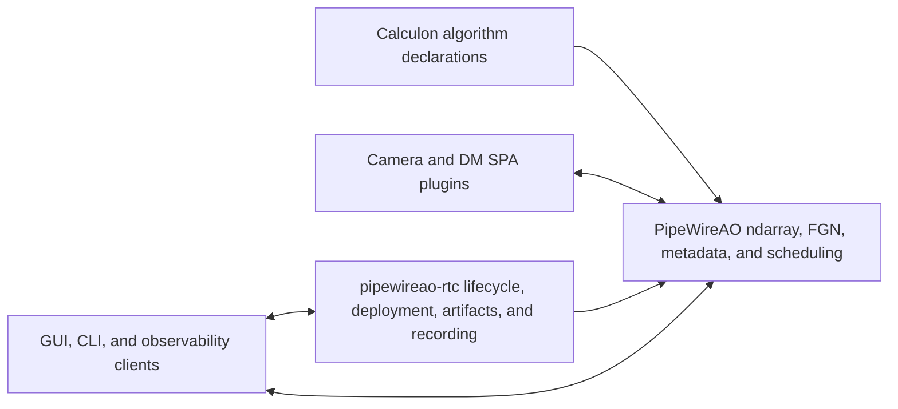

\page page_pipewireao_rtc_integration PipeWireAO RTC integration boundary

# PipeWireAO RTC integration boundary

Status: architecture boundary

Review date: 2026-08-29

## Purpose

PipeWireAO provides the reusable data-plane mechanisms used by an adaptive
optics real-time controller. The separate `pipewireao-rtc` repository owns the
headless RTC product and its operational policy. Keeping this boundary explicit
prevents product lifecycle and observatory policy from becoming part of the
PipeWire daemon while preserving one authoritative implementation of the
real-time transport and graph mechanisms.

## PipeWireAO authority

This repository owns generic, versioned mechanisms:

- the [ndarray filter-graph ABI and host](filter-graph-ndarray.md);
- the [acquisition identity and timing metadata ABI](acquisition-metadata.md);
- [row-block ndarray transport](row-block-ndarrays.md);
- [progressive wavefront-sensor execution](progressive-wavefront-processing.md);
- [polling data-loop scheduling](polling-data-loops.md); and
- ordinary PipeWire node, port, property, buffer, and metadata behavior.

These mechanisms must remain usable by clients other than the RTC product.

## `pipewireao-rtc` authority

The product repository owns:

- instrument and service lifecycle;
- desired-versus-observed state and deployment transactions;
- configuration and artifact admission;
- graph selection and activation policy;
- deformable-mirror command authority and operational interlocks;
- telemetry selection, recording, indexing, and reconstruction;
- operator and GUI-facing control semantics;
- system-level time, causality, audit, and performance contracts; and
- the product implementation roadmap and acceptance gates.

The product consumes public, versioned PipeWireAO interfaces. It must not rely
on daemon-private pointers, internal object layouts, or undocumented callback
behavior. Scientists declare algorithms through Calculon; they are not required
to implement PipeWire, SPA, raw-pointer, or real-time publication machinery.

The product documentation is maintained in the sibling `pipewireao-rtc`
repository. A canonical web link will be added here when that repository is
published.
