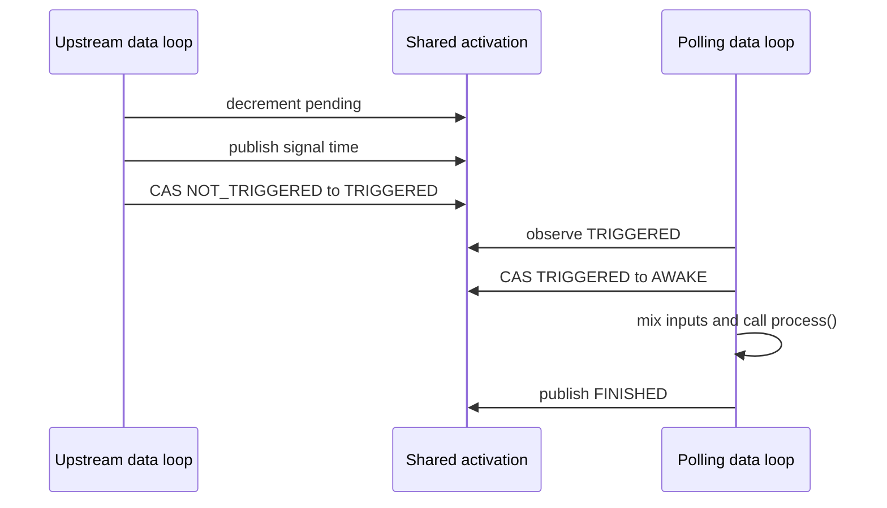
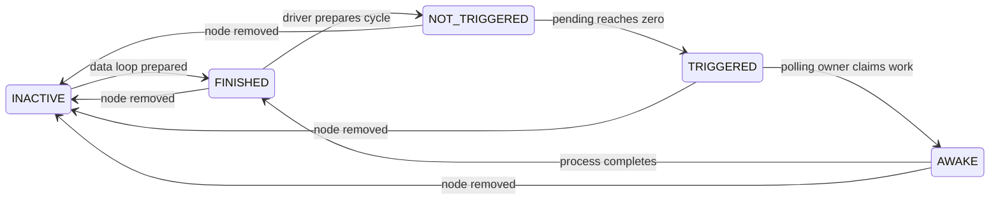

\page page_polling_data_loops Polling data loops

# Polling data loops

## Purpose

A polling data loop is an opt-in idle policy for a normal PipeWire data loop.
It busy-polls graph activation state instead of blocking in epoll. The graph is
still calculated by `module-scheduler-v1`, nodes still obey the normal
dependency counters, and buffers still use their negotiated SPA I/O contract.

On the repeated path, a dependency publishes `TRIGGERED` and the destination
loop observes it directly:



The successful status transition is the publication boundary. A polling target
does not require an eventfd write, eventfd read, or a timeout-zero kernel poll
for each activation.

Polling changes wake-up latency and CPU use. It does not create an asynchronous
queue, overlap adjacent synchronous graph cycles, replace semantic joins, or
make a slow algorithm meet a deadline.

The benchmark method, raw histograms, environment record, and current host
results are documented in [Polling data-loop benchmark](polling-data-loop-benchmark.md).
Hardware-counter and call-graph results are documented in
[Polling data-loop profiling](polling-data-loop-profiling.md).
Exported-node buffer-transit latency and counters are documented in
[Exported-node graph scheduling benchmark](polling-remote-graph-benchmark.md).

## Configuration

Set `loop.idle = busy-spin` on a context data loop and assign nodes with the
existing `node.loop.name` or `node.loop.class` properties.

```ini
context.data-loops = [
    {
        loop.name = rtc
        thread.name = rtc
        loop.class = data.rt
        loop.idle = busy-spin
        loop.rt-prio = -1
        thread.affinity = [ 2 ]
    }
    {
        loop.name = observer
        thread.name = observer
        loop.class = data.rt
        loop.idle = eventfd
        loop.rt-prio = -1
        thread.affinity = [ 4 ]
    }
]
```

`eventfd` is the default idle policy. `busy-spin` reserves a CPU while the
loop is running. Put independent latency-critical loops on distinct physical
cores. An observer loop normally remains eventfd-driven behind a bounded
asynchronous queue.

The public `pw_data_loop_is_polling()` query reports the configured policy.
No private RTC data-loop type or per-node polling thread exists.

## Bounded polling work

A polling loop owns a bounded list of prepared local nodes. Each scan:

1. examines each enabled node once;
2. claims and processes activations already in `TRIGGERED`;
3. probes eligible polling graph drivers once;
4. executes queued control invocations; and
5. releases and reacquires the loop lock so lifecycle operations can modify the
   list.

The loop uses a processor relax instruction when a scan found no work. It does
not dispatch arbitrary fd, timer, signal, or idle sources. Adding a poll driver
to a non-polling loop, or relying on fd dispatch from a polling loop, is
rejected instead of silently changing the latency contract.

The lock handoff is an administrative boundary. It permits Pause, Suspend,
port changes, and destruction to remove a source without racing `process()`.
It is not a kernel wait in the uncontended activation path.

## Ordinary followers

A normal local follower on a polling loop uses the same activation lifecycle as
an eventfd follower:



Input mixing, the SPA `process()` call, output teeing, peer activation, xrun
recovery, and profiler timestamps are unchanged. Only the wait mechanism is
different.

## Polling graph drivers

`SPA_NODE_FLAG_POLL_DRIVER` identifies a source whose nonblocking
`process()` method discovers one new driver quantum. Such a node must:

- advertise `node.driver = true`;
- be selected as its own graph driver;
- run on a `busy-spin` data loop; and
- return `SPA_STATUS_OK` when no quantum is ready.

A positive data status starts the ordinary driver-ready path. PipeWire resets
dependencies, publishes the source output, and runs one normal graph cycle.
The polling source is registered in a disabled state while the node is
prepared, then enabled only after its SPA `Start` command completes. This
prevents the polling thread from entering a device SDK while startup is still
mutating that device.

The source is not probed again until its followers complete that cycle. Its
self-activation closes the cycle without invoking the source a second time.

This contract permits the camera or device to continue DMA while downstream
nodes process the last published quantum. It deliberately permits at most one
published quantum per completed synchronous graph cycle. If adjacent cycles
must overlap or overload must drop work, put an explicit bounded asynchronous
queue at that topology boundary.

The flag describes process ownership and is immutable after the node first
reports its flags. A poll driver cannot be assigned an external driver.

## Exported and remote nodes

Activation version 1 is shared between the daemon and an exported node's
implementation process. The process that owns `process()` sets
`PW_NODE_ACTIVATION_FLAG_POLLING` in that shared record when its assigned
loop is polling.

Every updated producer checks the destination record after the final dependency
arrives:

- for an eventfd target, publish `TRIGGERED` and write the target eventfd;
- for a polling target, publish `TRIGGERED` and omit the eventfd write.

The decision is per destination. Polling and eventfd nodes can coexist in one
graph and can share an upstream producer. The eventfd remains part of the
transport so the inactive node can later be assigned an eventfd loop without a
protocol extension.

The daemon-side remote node represents topology; it does not execute or poll
the client implementation. Each process that owns polling nodes needs its own
configured polling loop and CPU reservation.

Version-0 activation records are rejected for polling because they lack the
atomic publication contract. An older version-1 producer remains functionally
correct but may continue writing the eventfd because it does not understand the
polling flag; the path is syscall-free only when every possible trigger honors
the flag.

## Memory ordering

For a polling target, the final producer writes cycle state and `signal_time`
before a successful atomic transition to `TRIGGERED`. The owner claims
`TRIGGERED -> AWAKE` before reading that state. Activation flags use atomic
read-modify-write because the daemon owns ASYNC and profiler bits while the
implementation process owns the polling bit.

These rules preserve the same dependency happens-before relationship across
threads and processes without using the eventfd as the wake-up operation.

## Limitations and qualification

Busy polling has important costs:

- one continuously active CPU per polling loop;
- sensitivity to CPU affinity, SMT sharing, IRQ placement, frequency policy,
  and thermal throttling;
- possible starvation of lower-priority administrative threads under
  `SCHED_FIFO`; and
- no automatic isolation from a slow node or slow observer.

Qualification must measure source-ready-to-`process()` latency, end-to-end
cycle latency, p50, p99, p99.9, maximum, xruns, deadline misses, CPU use, queue
age, and drops. Use fixed-rate open-loop arrivals and overload tests in addition
to closed-loop microbenchmarks.

Use eventfd loops when CPU efficiency matters more than the wake-up tail. Use a
polling loop only for the measured latency-critical process owner.
