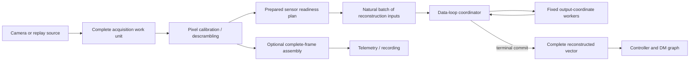
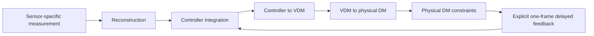

\page page_progressive_wavefront_processing Progressive wavefront-sensor processing

# Progressive wavefront-sensor processing

Status: design proposal; no fixed-worker implementation is claimed here

Review date: 2026-08-28

## Purpose

This document describes how Calculon algorithms can overlap wavefront-sensor
readout with scientific processing and use a fixed set of CPU cores without
making threading part of the scientist-facing algorithm API. It extends the
current [row-block ndarray design](row-block-ndarrays.md) from the REVOLT
Classic Shack--Hartmann case to pyramid wavefront sensors (PWFSs) and the
SPIDERS self-coherent camera (SCC).

The design has been checked against the source and configuration present in
the local working trees at the review date:

- REVOLT Copper (`revolt-rtc`), a four-pupil PWFS;
- GPI 2.0 (`gpi2.0-rtc`), a four-pupil PWFS with a descrambled NuVu readout;
- SPIDERS (`spiders/sccservice`), whose current SCC controller applies a
  selected-pixel linear map; and
- the existing REVOLT Classic Calculon and ndarray filter-graph qualification.

This is a proposed common execution design, not evidence that each camera
already exposes early pixels. The observed Copper and SPIDERS configurations
receive whole Aeron image messages. The observed GPI 2.0 NuVu handler contains
a progressive implementation but explicitly disables it because it is
currently reported broken. All three systems can still use whole-frame
parallel linear algebra before their early-readout paths are qualified.

## Decision summary

Progressive acquisition and parallel calculation are separate capabilities:

| Capability | What it changes | Can be used alone |
| --- | --- | --- |
| Progressive acquisition | Starts useful work before the last detector pixel arrives | yes |
| Fixed-worker execution | Reduces the service time of sufficiently large prepared operations | yes |

The first implementation should use a host-managed, fixed worker group. Worker
creation, affinity, wake policy, partitioning, dispatch, and synchronization
remain runtime concerns. A scientist continues to declare an ordinary typed
Calculon algorithm, its ports, shapes, schemas, configuration, properties, and
large parameters. The declaration does not contain worker IDs, queues, C
callbacks, atomics, or PipeWire types.

For a dense linear operation

```text
y = A x
```

each execution lane owns a disjoint range of output coordinates (rows of
`A`). Every lane consumes the same ordered input batches and writes only its
own range of `y`. This avoids shared partial vectors and a reduction lock. A
partial-vector reduction, when unavoidable, remains part of the linear
operator; it is not delegated to the controller integrator.

The serial Calculon implementation remains the reference and fallback. The
parallel facility is an optional prepared backend for operations with known
partition semantics. The runtime must not infer that an arbitrary algorithm is
parallel merely because its ports contain ndarrays.

## Vocabulary

The design deliberately separates detector layout, scientific coordinates,
and execution partitions:

| Term | Meaning |
| --- | --- |
| Acquisition work unit | One complete immutable camera artifact made available at once |
| Acquisition ordinal | Monotonic position of a work unit within one detector frame |
| Detector coordinate | A physical or descrambled image row and column |
| Reconstruction-input coordinate | One slope, selected pupil pixel, gradient, or SCC residual pixel in the scientific input vector |
| Readiness plan | Prepared mapping from acquired elements to newly complete reconstruction-input coordinates |
| Natural batch | The newly ready coordinates submitted together to amortize dispatch cost |
| Output coordinate | One reconstructed mode, controller coordinate, VDM coordinate, or physical actuator value produced by an operation |
| Execution shard | One runtime-owned, disjoint output-coordinate range |

An execution shard is not a graph port and is not a scientific coordinate
class. In particular, it must not be confused with controlled, extrapolated,
or fixed VDM roles. Each graph stage partitions its own output space.

## Architecture

The source publishes only complete immutable artifacts. No PipeWire buffer is
visible while a camera or worker is still changing it.



One prepared readiness plan converts camera-specific arrival into a common
ordered scientific input stream. The reconstruction backend therefore does
not need to know whether an input came from a conventional detector row, one
of four pyramid pupils, a NuVu tap, or an SCC dark-hole mask.

The frame-observer branch is independent. It may assemble a complete image for
telemetry without delaying the progressive control branch.

### Acquisition work units

For a conventional rolling readout, one work unit is `N` contiguous complete
detector rows. Standard Header metadata supplies the frame sequence, first row,
terminal marker, discontinuity state, and timestamp as described by the
row-block ndarray contract.

That representation is insufficient for every detector. The GPI 2.0 NuVu
descrambler maps one raw input row to two separated rows in the final image.
The portable concept must therefore be an acquisition work unit rather than an
ever-growing contiguous detector prefix.

The preferred representation for a static readout map is:

1. publish one complete immutable ndarray for each acquisition quantum;
2. use Header `seq` for frame identity and Header `offset` for the acquisition
   ordinal; and
3. use construction configuration to prepare the fixed mapping from that
   ordinal and element position to detector or reconstruction-input
   coordinates.

The schema identifies the meaning and layout of the work unit. A readout-map
change requires graph reconstruction. This avoids attaching a large row-index
list to every buffer. If the mapping can change from frame to frame, a separate
versioned metadata or paired-artifact contract will be required; it must not be
inferred from arrival time.

The existing contiguous row-block schemas keep their current meaning. A new
schema is required before non-contiguous work units are admitted. An
implementation must not reinterpret the existing Header row offset as an
acquisition ordinal without changing the schema.

### Sensor readiness

Readiness is a prepared scientific mapping, not scheduler logic.

#### Shack--Hartmann WFS

A subaperture becomes ready after every detector pixel in its explicitly
configured rectangle has arrived. Common subaperture size is construction
configuration; every subaperture has its own zero-based origin. A prepared
completion schedule handles lenslet-boundary gaps without assuming a uniform
origin grid.

The completed subaperture produces its X/Y slope pair. The pair can be
submitted immediately as two reconstruction-input coordinates. Preserving the
canonical subaperture and X/Y order preserves the per-output accumulation
order.

#### Pyramid WFS

PWFS readiness depends on the configured scientific representation:

- In direct pupil-pixel mode, a selected calibrated pixel is potentially one
  reconstruction-input coordinate. If the normalization uses a gain committed
  by the preceding complete frame, selected pixels can be consumed as they
  arrive. The current Calculon pyramid row algorithm uses this previous-frame
  normalization state and publishes only after terminal completion.
- In a four-pixel or quad-cell representation, one pupil coordinate becomes
  ready only after the corresponding pixels from all four pupils are ready. A
  prepared schedule records the maximum acquisition ordinal for each quartet.
- A current-frame global normalization introduces a frame-wide dependency. It
  either delays normalized coordinates until terminal completion or requires a
  separately proved algebraic transformation. The runtime must not silently
  substitute previous-frame normalization.

Explicit pupil origins and a shared pupil mask are scientific configuration.
They determine coordinate identity and readiness; a visually regular
four-quadrant detector layout must not be assumed.

#### Self-coherent camera

The observed SPIDERS SCC hot path selects image pixels, subtracts a reference
image, and applies a dense linear map directly to actuator coordinates:

```text
command = M * selected(image - reference)
```

Each selected residual pixel is independently ready after its calibrated pixel
arrives. The readiness plan maps detector positions selected by the active
mask to the matrix's canonical input-column order. The matrix can be repacked
during preparation into output-major storage for cache-friendly output
sharding.

The reference image, masks, and interaction/reconstruction matrix are large
prepared parameter state. Full-dark-hole versus half-dark-hole selection is a
frame-boundary scalar property if it does not change port shapes. Any mask
change that changes the selected-pixel extent must be paired with a compatible
matrix update or rebuild.

This conclusion applies to the current affine SCC service. A future SCC
algorithm that performs a current-frame FFT, estimates coherence across probe
frames, or otherwise needs a complete image or frame set has a corresponding
barrier. The same worker facility may parallelize that operation, but it cannot
publish a command before the required scientific inputs exist.

## Fixed-worker execution

### Ownership

The ndarray graph host owns a fixed worker group for the lifetime of an active
graph. It creates, pins, and destroys workers outside repeated processing. A
configured group consists of the data-loop coordinator plus zero or more
helper lanes. The coordinator should compute one shard while helpers compute
the others rather than spend the entire interval polling.

For each input batch:

1. the coordinator publishes one immutable job descriptor to preallocated,
   cache-line-separated worker slots with release ordering;
2. each lane accumulates the batch into only its private output-coordinate
   range;
3. each helper publishes completion with release ordering; and
4. the coordinator observes every completion with acquire ordering before the
   borrowed input buffer can be returned.

The first version should use a synchronous, bounded fork/join for each natural
batch. This matches the current synchronous filter graph and keeps the input
buffer lifetime simple. Dispatching one job per pixel is prohibited: the
readiness plan must form batches large enough to amortize rendezvous overhead.

There is no mutex, condition variable, allocation, deallocation, reference
count destruction, or system call in the hard-real-time repeated path.
High-rate reserved workers may poll their preallocated slots. A separately
qualified relaxed mode may park between jobs and accept wake-system-call
latency; it must not inherit the zero-system-call claim. Transitions between
polling and parked modes occur only through lifecycle or idle control outside a
data-loop callback. Both policies require measurement on the target
controller.

The existing FGN contract forbids a plugin from blocking or managing its own
thread pool. The worker group must therefore be a graph-host facility with a
normatively specified bounded rendezvous, not a private plugin convention.
The FGN ABI and traceability ledger must be amended before the capability is
claimed complete.

### Output-coordinate partitioning

For a row-major matrix with `m` output rows and `n` input columns, lane `k`
owns a fixed half-open row range `[r0, r1)`. For every ordered input batch
`[c0, c1)`, it performs:

```text
for r in r0:r1
    accumulator[r] += A[r, c0:c1] * x[c0:c1]
```

No two lanes write the same accumulator. No final vector sum is required. A
terminal barrier merely establishes that all output ranges are complete before
the logical ndarray is published.

Input-coordinate sharding is a fallback for an operation whose storage layout
or kernel strongly favors it. It creates one partial output vector per lane and
therefore needs a deterministic reduction owned by that operation. The
controller integrator must not be renamed or changed to hide this reduction:

```text
reconstruction: r = R s
integrator:      u[k] = p * u[k-1] + g * r
```

These remain distinct scientific operations even if a later measured runtime
optimization fuses their memory passes.

### Frame commit and failure

One frame uses one preallocated inactive accumulator set. A result becomes
visible only after the terminal work unit and every required worker complete.
On a gap, duplicate, sequence change, corrupt input, invalid terminal marker,
worker failure, or missed internal deadline:

- abandon every partial accumulator for that frame;
- publish no reconstruction result;
- do not advance previous-frame normalization or controller state;
- mark the next complete result discontinuous; and
- expose a bounded diagnostic counter off the data loop.

Partial results are never sent to downstream graph nodes. A source or node must
not overwrite an in-use frame slot. If fixed capacity is exhausted, the policy
is to drop the complete affected frame rather than overwrite partial state.

Parameters and scalar properties are snapshotted consistently for a frame.
Large replacements are prepared off the data loop, published through bounded
slots, and reclaimed off the data loop after an acknowledgment. With the
current graph-cycle adoption contract, an update observed after row zero makes
the partial frame discontinuous and causes it to be abandoned. A future
frame-boundary adoption hook could defer that update instead, but it must
preserve the same no-mixed-plan guarantee.

## Graph boundaries

The following are logical graph stages, not required worker boundaries:



Each dense stage can use a different output partition:

| Stage | Owned output-coordinate space |
| --- | --- |
| sensor reconstruction | controller residual coordinates or reconstructed modes |
| leaky integrator | controller state coordinates |
| controller-to-VDM | active VDM coordinates |
| active-to-full VDM | full VDM coordinates |
| VDM-to-PDM | physical actuator coordinates |
| feedback projection | destination feedback coordinates |

A leaky integrator with independent coordinates is directly shardable. Global
mean or hidden-mode removal, command-power limits, inter-actuator stroke
constraints, and other coupled operations require an explicit barrier and
reduction or a serial suffix. The graph must preserve the one-frame feedback
delay; worker completion does not create feedback semantics.

The first rollout should parallelize reconstruction only. Integrator and DM
stages remain ordinary graph nodes until measurements justify more complexity.
This also avoids depending on graph-wide rollback, which the current
synchronous FGN host does not provide after a downstream node failure.

Composite Calculon implementations remain useful at a latency boundary. A
composite is a prepared composition of the same typed scientific operations,
not a second hand-written version of the science. It may avoid materializing
large intermediate arrays or expose progressive inputs while retaining logical
operation boundaries and a serial oracle. Tiny pixel operations should not be
expanded into one filter-graph callback per pixel.

## Instrument applicability

The dimensions below are observations from the inspected local working trees.
They are qualification inputs, not new authorities for instrument
configuration.

| Instrument | Checked-in scientific path | Fit | Missing admission evidence |
| --- | --- | --- | --- |
| REVOLT Classic SHWFS | 352 x 352 detector; 188 explicit subapertures; 376 slopes; 221 controller coordinates; 277 PDM actuators | Existing serial row composition is the reference case; output-coordinate reconstruction sharding applies directly | scheduled end-to-end camera-to-DM benchmark and fixed-worker implementation |
| REVOLT Copper PWFS | 64 x 64 detector; four 30 x 30 pupils; pixel mode maps 3600 pixels to 253 modes; gradient mode maps 1800 values to 253 modes; 277-actuator PDM; observed 500 Hz Aeron source | Good fit for prepared pupil readiness and a 253-row reconstruction partition | actual early-work-unit source, exact pixel-normalization oracle, and target-core benchmark |
| GPI 2.0 PWFS | 242 x 240 detector; 2825 selected pixels in each of four pupils; 11300 pixels to 1810 modes; 97 woofer and 2304 tweeter actuators | Strong compute case: about 20 million reconstruction coefficients; stage-specific output sharding applies to reconstruction and later projections | NuVu progressive mode is disabled as broken; its non-contiguous descrambled arrival needs a new work-unit schema and qualification |
| SPIDERS SCC | calibration scripts use a 640 x 512 image; current service selects and reference-subtracts pixels, then maps directly to a 468-coordinate actuator command | Current affine map is naturally progressive and output-shardable | production source currently supplies a whole Aeron image; mask-selection semantics and Julia/native parity need an oracle; CRED2 early-row publication is not yet present |

### REVOLT Copper

The observed Copper configuration selects PWFS pixel mode and an explicit
file of four pupil origins. It must be represented as geometry and mask data,
not as four hard-coded regular quadrants. A prepared schedule can emit selected
pupil pixels in the matrix's declared column order. The 253 reconstruction
rows are then divided among the fixed lanes. The later 253-coordinate VDM and
277-actuator PDM operations use their own partitions if they are ever
parallelized.

The current configuration sets the global-gradient-normalization flag to zero,
but that flag alone does not prove the pixel-mode normalization equation. The
existing Copper implementation and recorded fixtures remain the oracle before
progressive output is admitted.

### GPI 2.0

GPI 2.0 is likely to benefit most from reconstruction parallelism because its
observed reconstructor has 1810 by 11300 elements. Full-frame
output-coordinate sharding can be implemented and benchmarked without waiting
for camera streaming.

The NuVu source cannot use the ordered contiguous-prefix assumption. Its
descrambler produces a top and bottom logical row from one raw row and reports
each logical row separately. A static acquisition-ordinal mapping can express
that order, after which the same PWFS readiness plan is used. Restoring camera
streaming is separate device work and must retain a whole-frame fallback.

After reconstruction, GPI's 1810-mode output branches into instrument-specific
woofer and tweeter paths. Those projections partition their 97- and
2304-actuator output spaces independently; they do not reuse REVOLT's
277-actuator partition.

### SPIDERS SCC

The current SCC service receives a complete image and uses Julia `mul!` with a
multithreaded OpenBLAS configuration. A first migration should keep whole-frame
input, call the same prepared native linear primitive from the Julia
declaration, and compare it with the existing service. This isolates worker
execution from acquisition changes and establishes numerical and timing
parity.

After that, a CRED2 source may publish truthful complete acquisition work units.
A filter that merely slices a frame after its last pixel arrives is useful for
correctness testing but cannot demonstrate an end-to-end latency improvement.

## Language boundary and scientist experience

The common low-level worker lifecycle and rendezvous should be implemented once
as a small transport-neutral C execution component. The ndarray graph host
owns one component instance when running under PipeWire; a native Calculon or
AdaptiveOpticsSim graph can own the same component without linking to the
PipeWire graph host. Rust and Julia declarations select prepared native task
primitives; they do not reproduce the thread pool. Rust may also provide an
audited native callback task where its ownership contract permits it. The first
Julia path should not call arbitrary Julia functions on C-created real-time
threads. It should call a qualified native primitive from Julia or use a
separately qualified Julia-managed execution mode.

The intended scientist-facing declaration remains approximately:

```text
algorithm name
construction dimensions and geometry
typed input and output ports with schemas
scalar runtime properties
large prepared parameter arrays
prepare expression
serial process expression
```

The scientist does not provide:

- a plugin registry entry in a separate repository;
- descriptor tables or C strings;
- PipeWire, SPA, or FGN callbacks;
- raw-pointer or errno handling;
- worker functions, atomics, affinity, or barriers; or
- publication and reclamation machinery.

Graph configuration chooses nodes, links, external ports, source mode, block
quantum, and operational worker policy. Scientific arrays such as origins,
masks, references, and reconstructors enter through their declared parameter
ports or construction inputs. The algorithm declaration remains usable in a
native Calculon or AdaptiveOpticsSim graph without PipeWire.

An optional parallel backend is admitted only for a declared operation shape
whose partition semantics the common adapter knows. Every other declaration
continues to execute its serial process expression. This fallback is what lets
scientists write normal algorithms without first designing a parallel runtime.

## Performance contract

There is no accepted latency threshold yet. Each instrument configuration must
declare a camera cadence, readout schedule, control deadline, CPU allocation,
and allowed drop policy before qualification.

Measure at least these intervals with a shared clock:

- first available detector work unit to published command;
- last available detector work unit to published command;
- terminal graph service time;
- complete trigger or acquisition timestamp to published command when the
  source exposes it; and
- inter-frame deadline misses, dropped frames, discontinuities, and worker
  overruns.

The second interval is the primary measure of how much pixel work was hidden
under camera readout. A faster isolated callback is not sufficient evidence.

Every benchmark should compare the same inputs and prepared state in four
modes where supported:

| Acquisition | Execution |
| --- | --- |
| whole frame | serial |
| whole frame | fixed workers |
| progressive work units | serial |
| progressive work units | fixed workers |

Sweep the work-unit quantum and coordinator-plus-helper counts. Record raw
samples, p50, p99, p99.9, maximum, misses, drops, CPU topology and affinity,
governor/frequency state, kernel, revisions, matrix hashes, and process order.
Use the real CBLUE 1, CRED2, NuVu, or replayed measured arrival schedule rather
than assuming uniform row timing.

Output-coordinate sharding can preserve one output's canonical input summation
order across worker counts. It may still differ from a previous BLAS kernel's
reduction order. Each system must state whether it requires bitwise equality or
a documented absolute/relative tolerance. State transitions and drop behavior
must match exactly even when floating-point output uses a tolerance.

## Implementation sequence

### Phase 0: freeze oracles and timing inputs

- Capture deterministic Classic, Copper, GPI 2.0, and SPIDERS input, parameter,
  state, and expected-output fixtures.
- Resolve Copper pixel-normalization and SPIDERS full/half-dark-hole semantics.
- Capture representative camera arrival schedules or clearly label simulated
  schedules.
- Define per-instrument numerical tolerances and latency/deadline targets.

Acceptance: every existing serial path can replay its fixture deterministically,
and every claimed timing comparison has a declared clock boundary.

### Phase 1: fixed workers with whole-frame dense linear algebra

- Add the host-owned fixed worker lifecycle and bounded release/acquire
  rendezvous.
- Implement output-coordinate sharding for a prepared F32 dense linear
  operator, with the coordinator computing one shard.
- Keep one serial lane as the zero-helper fallback.
- Provide Rust and Julia bindings to the same native task primitive.
- Interpose or audit allocation, destruction, locks, and system calls in the
  repeated path.

Acceptance: serial, one-lane native, and multi-lane outputs satisfy the chosen
numerical contract; sanitizer and race tests pass; fixed capacity and teardown
are proved; whole-frame scaling is measured rather than assumed.

### Phase 2: REVOLT Classic progressive proof

- Replace only the reconstruction accumulator in the existing serial row
  composite with output-coordinate shards.
- Preserve explicit subaperture origins, scientific slope order, conditional
  terminal publication, discontinuity behavior, and the serial oracle.
- Test two to four total lanes and sweep block height with the simulated camera
  readout before changing downstream controller nodes.

Acceptance: complete Classic outputs and state match the qualified serial graph,
and last-pixel-to-command latency improves at a declared readout cadence without
increasing deadline misses.

### Phase 3: REVOLT Copper PWFS

- Add Copper pupil origins, mask, normalization, and reconstruction fixtures.
- Reuse the prepared PWFS readiness operation with the fixed reconstruction
  workers.
- Qualify a real source that exposes complete early work units; retain the
  whole-frame mode.

Acceptance: pixel-mode output and the complete DM command match Copper's oracle,
and an end-to-end camera schedule shows whether progressive operation helps at
500 Hz and at the camera's maximum qualified rate.

### Phase 4: GPI 2.0 PWFS

- First qualify the 1810 by 11300 whole-frame MVM with fixed workers.
- Specify and test the non-contiguous acquisition-work-unit schema and prepared
  NuVu mapping.
- Repair and independently qualify the camera's disabled progressive mode.
- Keep reconstruction, woofer, and tweeter output partitions distinct.

Acceptance: full-frame parallel execution is production-safe independently of
streaming; progressive admission additionally requires live NuVu row-identity,
loss, restart, and end-to-end timing evidence.

### Phase 5: SPIDERS SCC

- Declare the existing selected-pixel/reference-subtraction/linear-map path in
  Julia with its current whole-frame input.
- Compare the fixed native operator with the existing OpenBLAS path for output,
  median, tails, CPU use, and jitter.
- Add CRED2 work-unit input only after whole-frame parity is established.

Acceptance: the Julia declaration remains usable without PipeWire, the live SCC
output and mask behavior match the frozen oracle, and early CRED2 processing is
claimed only after a source publishes data before frame completion.

### Phase 6: measured downstream expansion

- Profile controller, VDM, PDM, and SCC suffixes after reconstruction is
  parallel.
- Shard independent linear stages only where their service time affects the
  deadline.
- Keep globally coupled constraints behind explicit barriers.
- Consider fused memory passes only when logical ports, one-frame delay, state
  rollback, and a serial reference remain observable and testable.

Acceptance: each added optimization has an isolated causal benchmark and does
not weaken graph semantics or scientist-facing declarations.

## Completion gates

Do not call progressive fixed-worker execution complete until all of the
following hold for its claimed instrument set:

- Ordinary typed Rust and Julia scientific declarations require no worker or
  FGN boilerplate.
- A serial fallback uses the same algorithm declaration and parameters.
- Every acquisition mapping has versioned schema, sequence, terminal, loss,
  and restart tests.
- Parameters and properties cannot mix generations within a frame.
- Repeated processing is bounded and has no allocation, destruction, lock, or
  system call on the qualified active path.
- Frame publication is all-or-nothing and a dropped frame does not advance
  scientific state.
- Worker count and block quantum cannot change coordinate identity or graph
  port formats.
- Numerical parity is demonstrated against each instrument's frozen oracle.
- Scheduled end-to-end results report tail latency and drops, not only direct
  callback service time.
- Julia foreign-thread, GC, exception, unload, and lifecycle behavior is either
  qualified or excluded by using only the native task primitive on host
  workers.

## Evidence basis

The review used the following local baselines and files. Calculon, PipeWire,
and SPIDERS contained local changes at the review date; those working-tree
contents, including the listed untracked Calculon and SPIDERS scripts, are part
of the observation and must not be mistaken for the named Git baseline alone.

| Repository or service | Git baseline | Primary evidence |
| --- | --- | --- |
| PipeWireAO | `ba969698428d42b28552899cb2e9b9b99a61c1f5` | `row-block-ndarrays.md`, `filter-graph-ndarray.md`, and the local ndarray graph and benchmark work |
| Calculon | `d30bb032dc2527ebd3e75ee3d0226473361ed997` | local `pyramid_pixel_row.rs`, `shack_hartmann_row_reconstruction.rs`, declarations, schemas, tests, and qualification documents |
| REVOLT Copper | `81720d6b1e0d9f603e5ebecb9329fc264e188329` | `doc/revoltCopper.dox` and `config/copper_config.yaml` |
| GPI 2.0 | `6817a62ece7f8489f8bf7bfffae88bf59f74cf70` | `doc/gpi2RtcDataDimensions.dox`, `doc/gpi2Pwfs.dox`, `doc/gpi2HoRecon.dox`, and `source/devices/src/nuvuEBusWfsHandler.cpp` |
| SPIDERS SCC service | `1ba895b44747eb63e599275831bd7a8497502c93` plus local changes | `src/state-machine.jl`, `start.sh`, and local SCC calibration/generator scripts |
| SPIDERS integrator service | `b1cf30b4b4eefd265524ff375c9c8f652e792106` plus local changes | `config-scc-bak.toml` and `src/state-machine.jl` |

## Known open decisions

- Exact host ABI for prepared task primitives and fixed-worker configuration.
- Whether a target needs a polling and a parked worker mode, and how transitions
  occur outside active processing.
- Minimum natural batch size and whether it should be chosen statically or from
  an offline benchmark.
- Non-contiguous acquisition-work-unit schema for GPI 2.0.
- Copper's authoritative pixel-normalization semantics.
- SPIDERS SCC full/half-dark-hole oracle and the production CRED2 readout map.
- Target controller core budgets and admitted deadline/drop thresholds.
- Whether later stateful fused stages need a graph-wide success/rollback hook.

Until those decisions are closed, the design is a suitable foundation for
incremental proofs, not a completed runtime capability.
