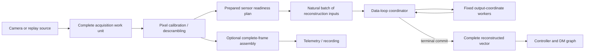
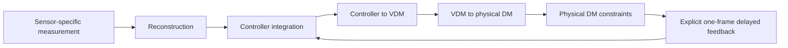

\page page_progressive_wavefront_processing Progressive wavefront-sensor processing

# Progressive wavefront-sensor processing

Status: synchronous fixed-worker foundation implemented; progressive
multi-batch execution remains a design proposal

Review date: 2026-08-28

## Purpose

This document describes how Calculon algorithms can overlap wavefront-sensor
readout with scientific processing and use a fixed set of CPU cores without
making threading part of the scientist-facing algorithm API. It extends the
current [row-block ndarray design](row-block-ndarrays.md) from the REVOLT
Classic Shack--Hartmann case to pyramid wavefront sensors (PWFSs) and the
SPIDERS self-coherent camera (SCC).

The design has been checked against the source and configuration present in
the local working trees at the review date:

- REVOLT Copper (`revolt-rtc`), a four-pupil PWFS;
- GPI 2.0 (`gpi2.0-rtc`), a four-pupil PWFS with a descrambled NuVu readout;
- SPIDERS (`spiders/sccservice` and the `SCC` optimization workspace), whose
  current SCC estimator applies a fixed raw-pixel masked and regularized
  reconstructor; and
- the existing REVOLT Classic Calculon and ndarray filter-graph qualification.

This document combines an implemented synchronous foundation with the
remaining asynchronous and instrument-qualification design. It is not
evidence that each camera already exposes early pixels. The observed Copper and SPIDERS configurations
receive whole Aeron image or differential-image messages. PipeWireAO already
has an `api.hnu240.decoder` plugin that transforms one complete HNü240 Camera
Link frame from 1408 by 131 GRAY8 into a 240 by 242 GRAY16 image. The existing
`api.ndarray.video-view` adapter exposes that exact packed image as a U16
raw-detector ndarray, and the Calculon FGN pixel-calibration operator converts
it to the F32 detector ndarray used by the generated PWFS graph. Thus the
current whole-frame topology is `camera -> api.hnu240.decoder ->
api.ndarray.video-view -> Calculon FGN pixel calibration -> ndarray filter
chain`. The decoder is the qualified whole-frame descrambling boundary, not a
progressive source. The
older GPI 2.0 NuVu handler contains a progressive implementation but explicitly
disables it because it is reported broken. All three systems can still use
whole-frame parallel linear algebra before their early-readout paths are
qualified.

## Decision summary

Progressive acquisition and parallel calculation are separate capabilities:

| Capability | What it changes | Can be used alone |
| --- | --- | --- |
| Progressive acquisition | Starts useful work before the last detector pixel arrives | yes |
| Fixed-worker execution | Reduces the service time of sufficiently large prepared operations | yes |

The first implementation uses a host-managed, fixed worker group. Worker
creation, wake policy, partitioning, dispatch, and synchronization remain
runtime concerns; affinity is a deferred runtime policy. A scientist continues
to declare an ordinary typed Calculon algorithm, its ports, shapes, schemas,
configuration, properties, and large parameters. The declaration does not
contain worker IDs, queues, C callbacks, atomics, or PipeWire types.

For a dense linear operation

```text
y = A x
```

each execution lane owns a disjoint range of output coordinates (rows of
`A`). Every lane consumes the same ordered input batches and writes only its
own range of `y`. This avoids shared partial vectors and a reduction lock. A
partial-vector reduction, when unavoidable, remains part of the linear
operator; it is not delegated to the controller integrator.

The serial Calculon implementation remains the reference and fallback. The
parallel facility is an optional prepared backend for operations with known
partition semantics. The runtime must not infer that an arbitrary algorithm is
parallel merely because its ports contain ndarrays.

## Vocabulary

The design deliberately separates detector layout, scientific coordinates,
and execution partitions:

| Term | Meaning |
| --- | --- |
| Acquisition work unit | One complete immutable camera artifact made available at once |
| Acquisition ordinal | Monotonic position of a work unit within one detector frame |
| Detector coordinate | A physical or descrambled image row and column |
| Reconstruction-input coordinate | One slope, selected pupil pixel, gradient, or SCC residual pixel in the scientific input vector |
| Readiness plan | Prepared mapping from acquired elements to newly complete reconstruction-input coordinates |
| Natural batch | The newly ready coordinates submitted together to amortize dispatch cost |
| Output coordinate | One reconstructed mode, controller coordinate, VDM coordinate, or physical actuator value produced by an operation |
| Execution shard | One runtime-owned, disjoint output-coordinate range |

An execution shard is not a graph port and is not a scientific coordinate
class. In particular, it must not be confused with controlled, extrapolated,
or fixed VDM roles. Each graph stage partitions its own output space.

## Architecture

The source publishes only complete immutable artifacts. No PipeWire buffer is
visible while a camera or worker is still changing it.



One prepared readiness plan converts camera-specific arrival into a common
ordered scientific input stream. The reconstruction backend therefore does
not need to know whether an input came from a conventional detector row, one
of four pyramid pupils, a NuVu tap, or an SCC dark-hole mask.

The frame-observer branch is independent. It may assemble a complete image for
telemetry without delaying the progressive control branch.

### Acquisition work units

For a conventional rolling readout, one work unit is `N` contiguous complete
detector rows. Standard Header metadata supplies the frame sequence, first row,
terminal marker, discontinuity state, and timestamp as described by the
row-block ndarray contract.

That representation is insufficient for every detector. The GPI 2.0 NuVu
descrambler maps one raw input row to two separated rows in the final image.
The portable concept must therefore be an acquisition work unit rather than an
ever-growing contiguous detector prefix.

The preferred representation for a static readout map is:

1. publish one complete immutable ndarray for each acquisition quantum;
2. use Header `seq` for frame identity and Header `offset` for the acquisition
   ordinal; and
3. use construction configuration to prepare the fixed mapping from that
   ordinal and element position to detector or reconstruction-input
   coordinates.

The schema identifies the meaning and layout of the work unit. A readout-map
change requires graph reconstruction. This avoids attaching a large row-index
list to every buffer. If the mapping can change from frame to frame, a separate
versioned metadata or paired-artifact contract will be required; it must not be
inferred from arrival time.

The existing contiguous row-block schemas keep their current meaning. A new
schema is required before non-contiguous work units are admitted. An
implementation must not reinterpret the existing Header row offset as an
acquisition ordinal without changing the schema.

### Sensor readiness

Readiness is a prepared scientific mapping, not scheduler logic.

#### Shack--Hartmann WFS

A subaperture becomes ready after every detector pixel in its explicitly
configured rectangle has arrived. Common subaperture size is construction
configuration; every subaperture has its own zero-based origin. A prepared
completion schedule handles lenslet-boundary gaps without assuming a uniform
origin grid.

The completed subaperture produces its X/Y slope pair. The pair can be
submitted immediately as two reconstruction-input coordinates. Preserving the
canonical subaperture and X/Y order preserves the per-output accumulation
order.

#### Pyramid WFS

PWFS readiness depends on the configured scientific representation:

- In direct pupil-pixel mode, a selected calibrated pixel is potentially one
  reconstruction-input coordinate. If the normalization uses a gain committed
  by the preceding complete frame, selected pixels can be consumed as they
  arrive. The current Calculon pyramid row algorithm uses this previous-frame
  normalization state, releases every complete row extent within each pupil
  independently of pupil-major declaration order, and publishes only after
  terminal completion. Its mean reduction remains in declared pupil order.
- In a four-pixel or quad-cell representation, one pupil coordinate becomes
  ready only after the corresponding pixels from all four pupils are ready. A
  prepared schedule records the maximum acquisition ordinal for each quartet.
- A current-frame global normalization introduces a frame-wide dependency. It
  either delays normalized coordinates until terminal completion or requires a
  separately proved algebraic transformation. The runtime must not silently
  substitute previous-frame normalization.

Explicit pupil origins and a shared pupil mask are scientific configuration.
They determine coordinate identity and readiness; a visually regular
four-quadrant detector layout must not be assumed.

#### Self-coherent camera

The paper's simplified SCC measurement and the observed SPIDERS runtime use a
differential image, selected dark-hole pixels, and one prepared reconstructor.
The deployed estimator can be written as:

```text
d[t]       = differential_image[t] - reference_image
y_raw[t]   = select_dark_hole_pixels(d[t])
delta_u[t] = transpose(R_spiders) * y_raw[t]
```

The upstream chopped-frame sorter forms the differential image from a fringed
and an unfringed exposure. Therefore a selected residual pixel is ready only
after both corresponding camera pixels are available, or after an upstream
node publishes that differential pixel as one complete work unit. Frame and
chopper-phase correlation are part of scientific readiness. A row from one
exposure must never be paired merely with the most recently arrived row from
the other exposure.

The strict-parity progressive path retains the first exposure's row and forms
each pixel difference when the correlated second row arrives, preserving the
existing subtraction-before-MVM arithmetic. Because the fixed-mask estimator
is linear, a separately qualified optimization may instead accumulate signed
fringed and unfringed contributions as each exposure arrives and apply a
prepared reference bias. That begins MVM work in the first exposure but changes
floating-point summation order; it needs an explicit tolerance and abandons its
inactive accumulator if the pair is incomplete.

The current `R_spiders` artifact is not a naive inverse. Offline calibration
applies Fourier-domain cleanup, per-mode spot masking, dark-hole masking, modal
basis conversion, SVD truncation, Tikhonov-style damping, and actuator
projection. Those preparation steps are already collapsed into the online
dense operator; the online loop does not perform an FFT or SVD.

The observed deployed dimensions are a 416 by 380 differential image, 22080
selected pixels, 424 SCC-owned modes, and 468 actuator outputs. The collapsed
F32 operator contains 10,333,440 coefficients, about 41.3 MB, and costs about
20.7 Mflop per frame. Each fixed-worker lane can own a disjoint subset of the
468 actuator-output rows and consume selected differential pixels in canonical
matrix-column order. This is the same reduction-free output-coordinate
partition used for PWFS reconstruction.

The full factorized estimator is only about 5.7 percent smaller in stored
coefficients and arithmetic at the current rank. A prepared two-stage `U` plus
`M` form is slightly smaller, but introduces a terminal intermediate vector and
a second matrix operation. The collapsed operator remains the default until a
target-controller benchmark shows that the two-stage form helps. Factorization
becomes structurally more attractive if calibration admits a rank materially
below 424.

The reference image, dark-hole support, calibration factors, and
interaction/reconstruction matrices are large prepared parameter state. The
observed full-dark-hole/half-dark-hole switch is currently ineffective and the
deployed overall mask is effectively half-dark-hole. It must be fixed and
captured by an oracle before it is exposed as a live property. A support change
that changes the selected-pixel extent requires a compatible matrix update or
graph rebuild.

##### Spatial demodulation (`9.2`)

The SCC optimization workspace also describes an explicit spatial lock-in
front end. It subtracts paired fringed/unfringed pixels, mixes by a prepared
complex carrier, applies a short separable FIR to both the masked signal and
mask support, normalizes locally, and optionally decimates before
reconstruction. This is spatial processing within one exposure pair, not a
multi-frame temporal lock-in.

The fixed separable FIR is progressively streamable. With a filter radius `r`,
one demodulated output row becomes ready after the paired input rows through
`row + r` are available. A fixed ring of horizontal-filter rows supplies the
vertical pass; terminal edge handling flushes the final `r` rows. The runtime
can then submit ready real and imaginary measurement coordinates directly to
the downstream reconstruction shards without materializing a full packed
measurement vector.

Dynamic bad-pixel or saturation masks make normalized convolution
frame-dependent, so this robust form must not be collapsed into one fixed
dense raw-pixel matrix. Its local structure, bounded halo, and mask support are
the reason to retain it as an explicit prepared algorithm. A proposed twofold
decimation per image axis is plausible only after the demodulation low-pass
filter and still requires calibration and closed-loop validation.

##### Adaptive masked solve (`9.5`)

The proposed `9.5` family replaces the frozen inverse with a weighted masked
least-squares solve. Contributions to its right-hand side or normal equations
may be accumulated as measurements arrive, but the final solution depends on
the complete admitted validity/weight set. It therefore has a terminal
scientific barrier even if the worker group hides some accumulation under
readout. Cached factorizations, rank updates, or iterative solvers need their
own bounded execution contract and are not implied by the dense-MVM worker
primitive.

Future SCC algorithms that estimate coherence across probe frames or perform
CDI have an additional frame-set barrier. The same worker facility may
parallelize work inside that boundary, but it cannot publish a command before
all scientifically required exposures exist.

## Fixed-worker execution

### Ownership

The ndarray graph host owns a fixed worker group for the lifetime of an active
graph. ABI v7 creates and destroys workers outside repeated processing but does
not yet assign affinity. A configured group consists of the data-loop
coordinator plus zero or more helper lanes. The coordinator computes one shard
while helpers compute the others rather than spend the entire interval
polling.

For each input batch:

1. the coordinator publishes one immutable job descriptor to preallocated,
   cache-line-separated worker slots with release ordering;
2. each lane accumulates the batch into only its private output-coordinate
   range;
3. each helper publishes completion with release ordering; and
4. the coordinator observes every completion with acquire ordering before the
   borrowed input buffer can be returned.

The implemented first version uses a synchronous, bounded fork/join for each
dense operation. This matches the current synchronous filter graph and keeps
the input-buffer lifetime simple. Dispatching one job per pixel is prohibited:
a future readiness plan must form batches large enough to amortize rendezvous
overhead.

### Current fixed-worker evidence

An ABI-v7 development-host diagnostic on 2026-08-28 used a Ryzen 7 6800H,
Linux 6.12.57, GCC 14.2, a release build, and the `performance` governor. Each
process was restricted to distinct physical cores 8, 10, 12, and 14 as its lane
count increased; ABI v7 did not pin individual threads within that set. The
isolated executor used a 277 by 376 F32 matrix, 10,000 warmups, 100,000
closed-loop samples per run, and five process repetitions. The paired clock
read median was 20 nanoseconds. Median-of-run results were:

| Helpers | Lanes | p50 | p99 | p99.9 | p50 speedup |
| ---: | ---: | ---: | ---: | ---: | ---: |
| 0 | 1 | 7.384 us | 11.702 us | 16.420 us | 1.00x |
| 1 | 2 | 3.837 us | 5.831 us | 7.764 us | 1.92x |
| 2 | 3 | 2.685 us | 3.697 us | 4.889 us | 2.75x |
| 3 | 4 | 2.234 us | 3.326 us | 4.087 us | 3.31x |

Every configured count was bitwise equal to the one-lane executor before and
after timing. The complete nine-node Classic graph also matched the direct
typed replay exactly at five public boundaries for seven frames and through
1,024 delayed-feedback frames with both zero and three helpers.

The next slice added generated fixed-lane execution for the existing typed
image-view Shack--Hartmann operation. Its 188 explicit Classic subapertures
form three cache-line-isolated output partitions; the same graph worker group
then executes the 221 by 376 reconstruction. Three alternating runs used 2,000
warmups, 10,000 samples, SCHED_FIFO priority 20, and physical CPUs 8, 10, 12,
and 14. Median-of-run results for the complete nine-node graph were:

| Helpers | p50 | p90 | p99 | p99.9 | p50 speedup |
| ---: | ---: | ---: | ---: | ---: | ---: |
| 0 | 134.352 us | 149.721 us | 187.271 us | 207.470 us | 1.00x |
| 3 | 79.640 us | 87.514 us | 100.067 us | 116.568 us | 1.69x |

All five public boundaries remained equal to the direct fixture for seven
frames, and delayed-feedback state remained equal through 1,024 frames. This
is direct callback service time, not scheduled camera-to-DM latency.

The equal-semantics 352 by 352, 256-subaperture, 277-output four-node benchmark
also ran three alternating repetitions. Median p50 was 179.877 microseconds
for the existing fused SPA controller, 138.139 microseconds for the serial
image-view graph, and 39.324 microseconds for the three-helper graph. The
worker result uses four physical cores while each serial result uses one, so it
demonstrates a deliberate CPU-for-latency exchange rather than a free
single-core optimization.

A Copper-sized 253 by 3600 dense reconstruction diagnostic used three
alternating repetitions of 3,000 warmups and 20,000 samples. Median p50 changed
from 43.151 microseconds to 12.453 microseconds with three helpers, a 3.47x
speedup. It proves the reconstruction shape benefits; it excludes pupil
normalization, graph scheduling, and the camera path.

The generated progressive adapters now cover both sensor front ends without
exposing runtime concepts to the scientific declaration. The SHWFS row plan
delegates newly ready ordered slope columns; the PWFS row composite delegates
the bounded set of newly ready pupil-major normalized-pixel row ranges while retaining its
previous-frame gain and declaration-order mean in the typed state machine.
PWFS readiness does not wait for a pupil-major prefix, which matters because
Copper rows from pupils 1 and 3 begin at detector row zero while rows from
pupils 0 and 2 begin at rows 33 and 34. Ranges from one detector block share
one worker rendezvous. Both adapters shard only
reconstructed output coordinates at cache-line boundaries and fall back to
the ordinary serial declaration without a multi-lane executor. Native tests
prove two-through-four-shard bitwise equivalence and worker-failure recovery;
the generated ABI and C graph tests exercise the real host helper group.

A Copper-scale graph sweep now covers the observed 64 by 64 detector, four 30
by 30 pupils, 3600 normalized pixels, and 253 reconstructed coordinates. With
four-row blocks, median p50 complete-frame, progressive-total, and terminal
service were 69.531, 120.667, and 9.769 microseconds in serial mode and 38.372,
95.639, and 8.366 microseconds with three helpers. At a modeled uniform 500
microsecond readout, progressive completion led the corresponding complete
frame by 59.9 microseconds serially and 29.8 microseconds with workers. Two-row
blocks reduced terminal work further but increased callback service and built
backlog at a 100-microsecond readout; four or eight rows is the current balanced
starting point. The observed 253 by 3600 FITS reconstructor also passed
numerical replay, but its worker timing exceeded the 10-percent stability gate.
These are direct graph callbacks plus an offline arrival model, not camera-to-DM
acceptance.

A three-repetition REVOLT-size SHWFS sweep then exposed the limit of the
synchronous design. With 22-row blocks, serial complete-frame, worker
complete-frame, serial progressive-total, and worker progressive-total p50
were 155.011, 69.010, 183.414, and 183.685 microseconds respectively. The
worker group accelerates the one large complete-frame task by about 2.25x but
does not reduce progressive total work because every ready batch pays a
fork/join rendezvous. Under the offline uniform-readout replay, progressive
workers crossed the worker complete-frame path at about 121 to 154
microseconds of detector readout, depending on row height, and led it by about
47 to 58 microseconds at a 500-microsecond readout. At a 100-microsecond
readout, whole-frame workers were faster. These are graph-callback and modeled
last-pixel-to-reconstruction results, not last-pixel-to-command acceptance.
They make asynchronous multi-batch submission the next SHWFS runtime
optimization rather than adding more synchronous per-block workers.

Flat cycle sampling of the four-node worker graph attributed 75.8 percent to
the existing typed Shack--Hartmann image partition, 14.8 percent to helper
polling, 4.2 percent to the dense AVX2 kernel, and 1.3 percent to the lane
rendezvous. The next numerical optimization remains image-view centroid
processing rather than graph scheduling.

Scheduling is part of the result. One SCHED_OTHER smoke run produced a similar
78-microsecond p50 but an approximately 8-millisecond p90 because a polling
helper was not scheduled promptly. Process-level CPU affinity does not reserve
cores or pin one lane to each core. A deployment MUST qualify its PipeWire data
loop and helpers under the intended real-time scheduling and CPU-reservation
policy before using the bounded-tail claim.

The polling cost is deliberate and substantial: the three-helper counter run
used approximately four CPUs continuously. This mode is suitable only when
those cores are reserved and the latency gain justifies them. The result is a
warmed service-time diagnostic, not camera-to-DM latency, an overload test, or
evidence for progressive multi-batch processing. Reproduce the isolated result
with `benchmark-filter-graph-ndarray-executor`; reproduce the complete graph
and fused comparison with Calculon's `qualify_fgn_revolt_classic.py` using
separate `--worker-helpers` settings.

### Deferred multi-batch pipeline

The synchronous worker facility is deliberately compatible with a later
within-frame multi-batch pipeline, but it does not claim that capability. A
multi-batch implementation removes the all-lane barrier after each camera work
unit. Every output-coordinate lane instead consumes ordered column-range jobs
and retains exclusive ownership of its accumulator rows. The graph performs
one terminal fence after the final admitted work unit, before reconstruction is
published or the controller and DM-command suffix run. Frames are not allowed
to overlap across a stateful control dependency merely because their detector
work units can overlap.

The current graph callback borrows an input buffer only until it returns.
Therefore an asynchronous lane must not retain a camera or graph-buffer pointer
without a new ownership protocol. The first multi-batch implementation should
copy each completed slope batch into a fixed preallocated ring because slopes
are materially smaller than detector blocks. A later source may instead lend a
buffer with an explicit retention token, or own a fixed ring slot that is not
recycled until every consuming lane acknowledges it. All three choices require
the same sequence and lifetime rules:

- one producer publishes a completely initialized slot with release ordering;
- every participating lane consumes slots in scientific column order;
- a slot is reusable only after every required lane publishes its
  acknowledgement with release ordering and the producer observes it with
  acquire ordering;
- generation, producer, and per-lane acknowledgement fields occupy separate
  cache lines; and
- payload storage is immutable from publication through final acknowledgement.

The ring capacity, maximum admitted batches per frame, and overload behavior
must be fixed at activation. A full ring must follow one declared policy:
bounded polling under a qualified scheduling budget, synchronous coordinator
assistance, or explicit frame abandonment with an overrun diagnostic. It must
not allocate, grow a queue, sleep, call a wake primitive, or silently overwrite
an in-flight slot. Frame abandonment invalidates the inactive accumulator and
advances no controller state.

An asynchronous producer cannot also be assumed to compute coordinator lane
zero: doing so may prevent it from admitting the next camera block. The
multi-batch design must measure and choose between a dedicated producer plus
all-helper computation, bounded producer assistance when the input ring is
empty, or a different fixed ownership schedule. That choice does not alter the
scientist-facing algorithm declaration. NUMA placement and cross-socket matrix
replication remain later target-specific policy.

There is no mutex, condition variable, allocation, deallocation, reference
count destruction, or system call in the hard-real-time repeated path.
High-rate reserved workers may poll their preallocated slots. A separately
qualified relaxed mode may park between jobs and accept wake-system-call
latency; it must not inherit the zero-system-call claim. Transitions between
polling and parked modes occur only through lifecycle or idle control outside a
data-loop callback. Both policies require measurement on the target
controller.

The existing FGN contract forbids a plugin from blocking or managing its own
thread pool. The worker group must therefore be a graph-host facility with a
normatively specified bounded rendezvous, not a private plugin convention.
The FGN ABI and traceability ledger must be amended before the capability is
claimed complete.

### Output-coordinate partitioning

For a row-major matrix with `m` output rows and `n` input columns, lane `k`
owns a fixed half-open row range `[r0, r1)`. For every ordered input batch
`[c0, c1)`, it performs:

```text
for r in r0:r1
    accumulator[r] += A[r, c0:c1] * x[c0:c1]
```

No two lanes write the same accumulator. No final vector sum is required. A
terminal barrier merely establishes that all output ranges are complete before
the logical ndarray is published.

Internal shard boundaries must coincide with cache-line boundaries in the
actual output address wherever more than one lane writes the vector. The first
and last lane own any unaligned prefix or suffix. Command, completion, mutable
workspace, and diagnostic fields written by different cores likewise occupy
separate cache lines. Sharing immutable input batches and matrix rows is
allowed; sharing a writable cache line between lanes is not.

Input-coordinate sharding is a fallback for an operation whose storage layout
or kernel strongly favors it. It creates one partial output vector per lane and
therefore needs a deterministic reduction owned by that operation. The
controller integrator must not be renamed or changed to hide this reduction:

```text
reconstruction: r = R s
integrator:      u[k] = p * u[k-1] + g * r
```

These remain distinct scientific operations even if a later measured runtime
optimization fuses their memory passes.

### Frame commit and failure

One frame uses one preallocated inactive accumulator set. A result becomes
visible only after the terminal work unit and every required worker complete.
On a gap, duplicate, sequence change, corrupt input, invalid terminal marker,
worker failure, or missed internal deadline:

- abandon every partial accumulator for that frame;
- publish no reconstruction result;
- do not advance previous-frame normalization or controller state;
- mark the next complete result discontinuous; and
- expose a bounded diagnostic counter off the data loop.

Partial results are never sent to downstream graph nodes. A source or node must
not overwrite an in-use frame slot. If fixed capacity is exhausted, the policy
is to drop the complete affected frame rather than overwrite partial state.

Parameters and scalar properties are snapshotted consistently for a frame.
Large replacements are prepared off the data loop, published through bounded
slots, and reclaimed off the data loop after an acknowledgment. With the
current graph-cycle adoption contract, an update observed after row zero makes
the partial frame discontinuous and causes it to be abandoned. A future
frame-boundary adoption hook could defer that update instead, but it must
preserve the same no-mixed-plan guarantee.

## Graph boundaries

The following are logical graph stages, not required worker boundaries:



Each dense stage can use a different output partition:

| Stage | Owned output-coordinate space |
| --- | --- |
| sensor reconstruction | controller residual coordinates or reconstructed modes |
| leaky integrator | controller state coordinates |
| controller-to-VDM | active VDM coordinates |
| active-to-full VDM | full VDM coordinates |
| VDM-to-PDM | physical actuator coordinates |
| feedback projection | destination feedback coordinates |

A leaky integrator with independent coordinates is directly shardable. Global
mean or hidden-mode removal, command-power limits, inter-actuator stroke
constraints, and other coupled operations require an explicit barrier and
reduction or a serial suffix. The graph must preserve the one-frame feedback
delay; worker completion does not create feedback semantics.

The candidate SPIDERS command path makes this distinction concrete:

```text
u_full_des = E_full * u_controlled + u_offset
u_command, r_full = project_constraints(u_full_des)
r_controlled = A_controlled * r_full
```

The prepared completion and anti-windup back-projection matrices are ordinary
linear stages and can own output-coordinate shards. The constrained projection
couples neighboring actuators, piston, hard bounds, smoothness, and optional
invisible modes. It therefore remains a bounded serial suffix or uses an
explicitly proved colored/reduction schedule after a barrier. It belongs to
the controller/command boundary, not to SCC measurement reconstruction.
Warmup-based zero-allocation results from the local Julia examples are useful
design evidence, but do not establish lock, system-call, tail-latency, or
foreign-thread behavior in the deployed graph.

The first rollout should parallelize reconstruction only. Integrator and DM
stages remain ordinary graph nodes until measurements justify more complexity.
This also avoids depending on graph-wide rollback, which the current
synchronous FGN host does not provide after a downstream node failure.

Composite Calculon implementations remain useful at a latency boundary. A
composite is a prepared composition of the same typed scientific operations,
not a second hand-written version of the science. It may avoid materializing
large intermediate arrays or expose progressive inputs while retaining logical
operation boundaries and a serial oracle. Tiny pixel operations should not be
expanded into one filter-graph callback per pixel.

## Instrument applicability

The dimensions below are observations from the inspected local working trees.
They are qualification inputs, not new authorities for instrument
configuration.

| Instrument | Observed scientific path | Fit | Missing admission evidence |
| --- | --- | --- | --- |
| REVOLT Classic SHWFS | 352 x 352 detector; 188 explicit subapertures; 376 slopes; 221 controller coordinates; 277 PDM actuators | Complete-image centroid/reconstruction workers and the synchronous progressive row reconstructor are implemented with serial oracles | scheduled end-to-end camera-to-DM benchmark, deadline/drop evidence, and asynchronous multi-batch optimization |
| REVOLT Copper PWFS | 64 x 64 detector; four 30 x 30 pupils; pixel mode maps 3600 pixels to 253 modes; gradient mode maps 1800 values to 253 modes; 277-actuator PDM; observed 500 Hz Aeron source | Whole-frame dense workers scale 3.47x; partial-pupil row processing, generated C workers, a Copper-size row sweep, and observed-matrix numerical replay are implemented | timestamp-faithful early-work-unit source, full controller/DM result, stable target-core worker qualification, deadline and drop evidence |
| GPI 2.0 PWFS | 242 x 240 detector; 2825 selected pixels in each of four pupils; 11300 pixels to 1810 modes; 97 woofer and 2304 tweeter actuators | Existing `api.hnu240.decoder` supplies a whole-frame descrambled image; the roughly 20-million-coefficient reconstruction is output-shardable | progressive NuVu mode is disabled as broken; its non-contiguous descrambled arrival needs a new work-unit schema and qualification |
| SPIDERS SCC | 416 x 380 differential image; 22080 selected pixels; fixed regularized 22080 x 468 reconstructor; 424 SCC-owned modes | The deployed MVM is output-shardable; explicit `9.2` is a separate local, row-streamable front end | production source supplies whole Aeron differential images; fringed/unfringed row-pair identity, HDH behavior, Julia/native parity, and CRED2 early publication remain unqualified |

### REVOLT Copper

The observed Copper configuration selects PWFS pixel mode and an explicit
file of four pupil origins. It must be represented as geometry and mask data,
not as four hard-coded regular quadrants. The recorded origins are `(33,34)`,
`(0,0)`, `(34,1)`, and `(0,34)` in pupil-major matrix-column order. Thus rows
from pupils 1 and 3 arrive well before corresponding rows from pupils 0 and 2.
The prepared schedule emits each complete pupil-row range immediately and the serial progressive oracle
accumulates those ranges in detector-arrival order. Every fixed lane preserves
that order while owning disjoint subsets of the 253 reconstruction rows, so no
column-partition reduction lock is required. The later 253-coordinate VDM and
277-actuator PDM operations use their own partitions if they are ever
parallelized.

The current configuration sets the global-gradient-normalization flag to zero,
but that flag alone does not prove the pixel-mode normalization equation. The
existing Copper implementation and recorded fixtures remain the oracle before
progressive output is admitted.

### GPI 2.0

GPI 2.0 is likely to benefit most from reconstruction parallelism because its
observed reconstructor has 1810 by 11300 elements. Full-frame
output-coordinate sharding can be implemented and benchmarked without waiting
for camera streaming.

The existing PipeWireAO HNü240 decoder accepts and publishes complete frames,
so it can feed the whole-frame PWFS graph without a new scientific algorithm.
The progressive NuVu source cannot use the ordered contiguous-prefix
assumption. Its legacy descrambler produces a top and bottom logical row from
one raw row and reports each logical row separately. A static
acquisition-ordinal mapping can express that order, after which the same PWFS
readiness plan is used. Extending the source/decoder boundary for streaming is
separate device work and must retain the existing whole-frame fallback.

After reconstruction, GPI's 1810-mode output branches into instrument-specific
woofer and tweeter paths. Those projections partition their 97- and
2304-actuator output spaces independently; they do not reuse REVOLT's
277-actuator partition.

### SPIDERS SCC

The current SCC service receives a complete differential image and evaluates
the collapsed reconstructor with Julia `mul!` and a multithreaded OpenBLAS
configuration. A first migration should preserve the 22080-to-468 operator,
whole-frame input, and downstream actuator-residual interface while comparing:

- the current Julia/OpenBLAS call;
- the serial prepared native operator;
- fixed-worker output-coordinate sharding; and
- the prepared two-stage `U` plus `M` form.

This isolates worker execution from acquisition and algorithm changes. The
collapsed form should remain authoritative unless the measured target favors a
different prepared representation.

After that, the CRED2 and chopped-frame path may publish truthful complete work
units for correlated fringed/unfringed rows. Row-pair loss or phase mismatch
abandons the affected differential frame pair and advances no controller state.
A filter that merely slices a differential frame after its last pixel arrives
is useful for correctness testing but cannot demonstrate an end-to-end latency
improvement.

Explicit `9.2` is a later, separately calibrated experiment: first qualify the
streaming FIR and normalized-convolution output, then test post-filter
decimation and its downstream reconstructor. Raw-pixel or demodulated `9.5` is
an adaptive-estimator rollout with a terminal solve, not a transparent
optimization of the existing MVM.

## Language boundary and scientist experience

The common low-level worker lifecycle and rendezvous is implemented once as a
small transport-neutral C execution component. The ndarray graph host owns one
component instance when running under PipeWire; a native Calculon or
AdaptiveOpticsSim graph can own the same component without linking to the
PipeWire graph host. The Rust declaration adapter selects prepared dense,
SHWFS image, and progressive reconstruction operations and does not reproduce
the thread pool. The deployment-only Julia binding now consumes the same
executor table and a qualification has entered warmed declared Julia code on
every persistent helper. The graph also has an explicit process-thread
preparation lifecycle. That closes the mechanical binding, not Julia
hard-real-time admission: AOT packaging, non-owning buffer projection, GC and
tail-latency behavior, publication, teardown, and instrument algorithm
coverage remain open. A production adapter may run Julia code on host workers
only after those gates are qualified; otherwise it uses the same native dense
primitive without a Julia callback.

The intended scientist-facing declaration remains approximately:

```text
algorithm name
construction dimensions and geometry
typed input and output ports with schemas
scalar runtime properties
large prepared parameter arrays
prepare expression
serial process expression
```

The scientist does not provide:

- a plugin registry entry in a separate repository;
- descriptor tables or C strings;
- PipeWire, SPA, or FGN callbacks;
- raw-pointer or errno handling;
- worker functions, atomics, affinity, or barriers; or
- publication and reclamation machinery.

Graph configuration chooses nodes, links, external ports, source mode, block
quantum, and operational worker policy. Scientific arrays such as origins,
masks, references, and reconstructors enter through their declared parameter
ports or construction inputs. The algorithm declaration remains usable in a
native Calculon or AdaptiveOpticsSim graph without PipeWire.

An optional parallel backend is admitted only for a declared operation shape
whose partition semantics the common adapter knows. Every other declaration
continues to execute its serial process expression. This fallback is what lets
scientists write normal algorithms without first designing a parallel runtime.

## Performance contract

There is no accepted latency threshold yet. Each instrument configuration must
declare a camera cadence, readout schedule, control deadline, CPU allocation,
and allowed drop policy before qualification.

Measure at least these intervals with a shared clock:

- first available detector work unit to published command;
- last available detector work unit to published command;
- terminal graph service time;
- complete trigger or acquisition timestamp to published command when the
  source exposes it; and
- inter-frame deadline misses, dropped frames, discontinuities, and worker
  overruns.

The second interval is the primary measure of how much pixel work was hidden
under camera readout. A faster isolated callback is not sufficient evidence.

Every benchmark should compare the same inputs and prepared state in four
modes where supported:

| Acquisition | Execution |
| --- | --- |
| whole frame | serial |
| whole frame | fixed workers |
| progressive work units | serial |
| progressive work units | fixed workers |

Sweep the work-unit quantum and coordinator-plus-helper counts. Record raw
samples, p50, p99, p99.9, maximum, misses, drops, CPU topology and affinity,
governor/frequency state, kernel, revisions, matrix hashes, and process order.
Use the real CBLUE 1, CRED2, NuVu, or replayed measured arrival schedule rather
than assuming uniform row timing.

Output-coordinate sharding preserves the pinned dense kernel's reduction order
for each output across worker counts. ABI v7 matches Calculon's current
`PreparedGemv<f32>` profile on the same target. A different architecture or a
future progressive split into several ACCUMULATE calls can use a different
floating-point grouping. Each system must state whether it requires bitwise
equality or a documented absolute/relative tolerance. State transitions and
drop behavior must match exactly even when floating-point output uses a
tolerance.

## Implementation sequence

### Phase 0: freeze oracles and timing inputs

- Capture deterministic Classic, Copper, GPI 2.0, and SPIDERS input, parameter,
  state, and expected-output fixtures.
- Resolve Copper pixel-normalization and SPIDERS full/half-dark-hole semantics.
- Capture representative camera arrival schedules or clearly label simulated
  schedules.
- Define per-instrument numerical tolerances and latency/deadline targets.

Acceptance: every existing serial path can replay its fixture deterministically,
and every claimed timing comparison has a declared clock boundary.

### Phase 1: fixed workers with whole-frame dense linear algebra

- Add the host-owned fixed worker lifecycle and bounded release/acquire
  rendezvous.
- Implement output-coordinate sharding for a prepared F32 dense linear
  operator, with the coordinator computing one shard.
- Keep one serial lane as the zero-helper fallback.
- Retain the Rust binding and add a Julia binding to the same native task
  primitive.
- Interpose or audit allocation, destruction, locks, and system calls in the
  repeated path.

Acceptance: serial, one-lane native, and multi-lane outputs satisfy the chosen
numerical contract; sanitizer and race tests pass; fixed capacity and teardown
are proved; whole-frame scaling is measured rather than assumed.

Implementation status: the C lifecycle and executor, Rust adapter, Julia
executor-table binding, four-lane Julia foreign-thread qualification, and
whole-frame dense scaling are implemented. Process-wide interposition, target
scheduling, Julia AOT/buffer/publication integration, and full teardown stress
remain open.

### Phase 2: REVOLT Classic progressive proof

- Replace only the reconstruction accumulator in the existing serial row
  composite with output-coordinate shards.
- Preserve explicit subaperture origins, scientific slope order, conditional
  terminal publication, discontinuity behavior, and the serial oracle.
- Test two to four total lanes and sweep block height with the simulated camera
  readout before changing downstream controller nodes.

Implementation status: the typed row state machine, transport-neutral marker,
generated output-shard adapter, serial fallback, two-through-four-shard tests,
real C helper-thread test, REVOLT-size block-height sweep, and uniform-readout
crossover model are complete. The adapter is still synchronous per ready
batch.

Acceptance: complete Classic outputs and state match the qualified serial graph,
and last-pixel-to-command latency improves at a declared readout cadence without
increasing deadline misses.

### Phase 3: REVOLT Copper PWFS

- Add Copper pupil origins, mask, normalization, and reconstruction fixtures.
- Reuse the prepared PWFS readiness operation with the fixed reconstruction
  workers.
- Qualify a real source that exposes complete early work units; retain the
  whole-frame mode.

Implementation status: the typed progressive PWFS composite, operation marker,
generated output-shard adapter, serial fallback, failure recovery, independent
out-of-order partial-pupil readiness, and a small deterministic C helper-thread
graph are complete. The authoritative Copper origins and matrix dimensions
have been identified. A repeatable Copper-scale graph harness now sweeps row
height, serial and fixed-worker execution, and uniform readout schedules; it
also accepts the observed 253 by 3600 FITS reconstructor. Full camera/controller
fixture replay, source admission, controller/DM parity, and deadline evidence
remain open.

Acceptance: pixel-mode output and the complete DM command match Copper's oracle,
and an end-to-end camera schedule shows whether progressive operation helps at
500 Hz and at the camera's maximum qualified rate.

### Phase 4: GPI 2.0 PWFS

- First qualify the 1810 by 11300 whole-frame MVM with fixed workers.
- Specify and test the non-contiguous acquisition-work-unit schema and prepared
  NuVu mapping.
- Repair and independently qualify the camera's disabled progressive mode.
- Keep reconstruction, woofer, and tweeter output partitions distinct.

Acceptance: full-frame parallel execution is production-safe independently of
streaming; progressive admission additionally requires live NuVu row-identity,
loss, restart, and end-to-end timing evidence.

### Phase 5: SPIDERS SCC

- Freeze the current 416 by 380 differential-image, 22080-pixel, 468-output
  estimator and downstream actuator-residual interface as the oracle.
- Declare that existing selected-pixel/reference-subtraction/reconstructor path
  in Julia with its current whole-frame input.
- Compare the collapsed native operator, fixed-worker output sharding, and
  two-stage `U` plus `M` with the existing OpenBLAS path for output, matrix
  traffic, median, tails, CPU use, and jitter.
- Add CRED2 work-unit input only after whole-frame parity is established, and
  join fringed/unfringed rows by explicit acquisition and chopper-phase
  identity.
- Treat the streaming `9.2` FIR, post-filter decimation, and any `9.5` solve as
  later algorithm qualifications rather than performance-preserving wrappers.

Acceptance: the Julia declaration remains usable without PipeWire, the live SCC
output and half-dark-hole behavior match the frozen oracle, and early CRED2
processing is claimed only after both required exposure rows are published
before differential-frame completion.

### Phase 6: measured downstream expansion

- Profile controller, VDM, PDM, and SCC suffixes after reconstruction is
  parallel.
- Shard independent linear stages only where their service time affects the
  deadline.
- Keep globally coupled constraints behind explicit barriers.
- Consider fused memory passes only when logical ports, one-frame delay, state
  rollback, and a serial reference remain observable and testable.

Acceptance: each added optimization has an isolated causal benchmark and does
not weaken graph semantics or scientist-facing declarations.

## Completion gates

Do not call progressive fixed-worker execution complete until all of the
following hold for its claimed instrument set:

- Ordinary typed Rust and Julia scientific declarations require no worker or
  FGN boilerplate.
- A serial fallback uses the same algorithm declaration and parameters.
- Every acquisition mapping has versioned schema, sequence, terminal, loss,
  and restart tests.
- Parameters and properties cannot mix generations within a frame.
- Repeated processing is bounded and has no allocation, destruction, lock, or
  system call on the qualified active path.
- Frame publication is all-or-nothing and a dropped frame does not advance
  scientific state.
- Worker count and block quantum cannot change coordinate identity or graph
  port formats.
- Numerical parity is demonstrated against each instrument's frozen oracle.
- Scheduled end-to-end results report tail latency and drops, not only direct
  callback service time.
- Julia foreign-thread, GC, exception, unload, and lifecycle behavior is either
  qualified or excluded by using only the native task primitive on host
  workers.

## Evidence basis

The review used the following local baselines and files. Calculon, PipeWire,
and SPIDERS contained local changes at the review date; those working-tree
contents, including the listed untracked Calculon and SPIDERS scripts, are part
of the observation and must not be mistaken for the named Git baseline alone.

| Repository or service | Git baseline | Primary evidence |
| --- | --- | --- |
| PipeWireAO | `861afa8485b1ce390f555dc6184d3b327701f0d2` plus the SCC revisions in this document | `row-block-ndarrays.md`, `filter-graph-ndarray.md`, and the ndarray graph and benchmark work |
| Calculon | `d30bb032dc2527ebd3e75ee3d0226473361ed997` | local `pyramid_pixel_row.rs`, `shack_hartmann_row_reconstruction.rs`, declarations, schemas, tests, and qualification documents |
| REVOLT Copper | `81720d6b1e0d9f603e5ebecb9329fc264e188329` | `doc/revoltCopper.dox` and `config/copper_config.yaml` |
| GPI 2.0 | `6817a62ece7f8489f8bf7bfffae88bf59f74cf70` | `doc/gpi2RtcDataDimensions.dox`, `doc/gpi2Pwfs.dox`, `doc/gpi2HoRecon.dox`, and `source/devices/src/nuvuEBusWfsHandler.cpp` |
| SPIDERS SCC service | `1ba895b44747eb63e599275831bd7a8497502c93` plus local changes | `src/state-machine.jl`, `start.sh`, and local SCC calibration/generator scripts |
| SPIDERS integrator service | `b1cf30b4b4eefd265524ff375c9c8f652e792106` plus local changes | `config-scc-bak.toml` and `src/state-machine.jl` |
| SCC optimization workspace | `eba08191e236822f8c437bde1eb2b280c24d3f53` plus local changes | `121852C.pdf`, `simplified_measurement_algorithm_discussion.md`, `spiders_scc_improvement_roadmap.md`, and `example_92_demodulation_fir.jl` |

## Known open decisions

- Exact host ABI for prepared task primitives and fixed-worker configuration.
- Whether a target needs a polling and a parked worker mode, and how transitions
  occur outside active processing.
- Minimum natural batch size and whether it should be chosen statically or from
  an offline benchmark.
- Non-contiguous acquisition-work-unit schema for GPI 2.0.
- Copper's authoritative pixel-normalization semantics.
- SPIDERS fringed/unfringed work-unit correlation, full/half-dark-hole oracle,
  and the production CRED2 readout map.
- Target controller core budgets and admitted deadline/drop thresholds.
- Whether later stateful fused stages need a graph-wide success/rollback hook.

Until those decisions are closed, the design is a suitable foundation for
incremental proofs, not a completed runtime capability.
