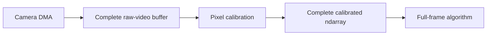
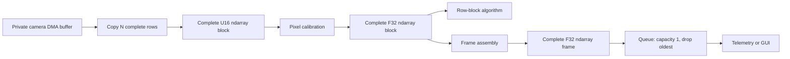

\page page_row_block_ndarrays Row-block ndarray processing

# Row-block ndarray processing

## Decision

Progressive camera work is represented as ordinary complete micro-buffers.
There is no progressively changing PipeWire buffer, progressive metadata, or
latest-buffer transport.

In eGrabber row-block mode, the camera DMA fills a private host buffer. The
source polls the camera's filled-size observation and copies each newly
complete group of `N` rows into a normal output buffer. That output is a
complete immutable U16 ndarray with shape `[N, width]`. Pixel calibration can
consume those blocks immediately and emits complete F32 row-block ndarrays. A
frame-assembly node restores `[height, width]` frames for full-frame
algorithms and observers.

The copy at the camera boundary gives each public artifact ordinary PipeWire
ownership. It removes the need to lease a buffer that the camera is still
changing.

## Topologies

Complete-frame mode preserves the camera's zero-copy path:



Row-block mode changes artifact granularity:



A source selects one output artifact contract for a configured port:

- `api.egrabber.output-mode = frame` publishes complete standard video
  buffers and may use direct camera buffers or DMA-BUF;
- `api.egrabber.output-mode = row-block` publishes complete raw ndarray
  blocks and uses private mapped camera storage plus one copy per block.

A source that accepts the row-block ndarray schema may also advertise a
complete-frame alternative. Format negotiation selects one exact shape for the
port. A single negotiated stream never mixes `[N, width]` and
`[height, width]` artifacts.

## Row quantum

`api.egrabber.row-block-rows = N` selects the public raw block height.
`api.calculon.row-block-rows = N` selects the calibrated block height and
assembly input. `N` must be positive, smaller than the detector height, and
divide the height.

For frame rate `F`, detector height `H`, and block height `N`:

```text
blocks_per_frame = H / N
block_rate = F * H / N
payload_bytes = N * line_stride
```

A smaller quantum exposes work sooner but raises scheduler, buffer, metadata,
copy-call, and algorithm overhead. A larger quantum amortizes overhead but
delays the first useful rows. The correct value is an empirical tradeoff
between readout cadence and downstream service time.

Each published block starts one ordinary graph cycle. A polling graph driver
does not publish the next block until the preceding synchronous cycle
completes. Camera DMA can continue meanwhile, so acquisition overlaps
calibration without overlapping public buffer ownership.

## Raw row-block contract

The raw schema identifier is
`org.calculon.ao.raw-pixel-row-block/1`. Its exact ndarray format is:

```text
mediaType    = application
mediaSubtype = ndarray
schema       = org.calculon.ao.raw-pixel-row-block/1
elementType  = U16_LE
shape        = [N, width]
layout       = ROW_MAJOR
profile      = detector profile
rate         = frame_rate * height / N
```

The calibrated schema is
`org.calculon.ao.calibrated-pixel-row-block/1` with the same shape, layout,
profile, and rate, but `F32_LE` elements. Both use ordinary
`SPA_IO_Buffers`; a buffer is immutable and complete when published.

## Frame and block identity

Every row-block buffer carries standard `SPA_META_Header` metadata:

| Field | Contract |
| --- | --- |
| `seq` | Stable frame or acquisition identity, equal for every block in one frame |
| `offset` | Zero-based first detector row in this block |
| `MARKER` | Set only on the block whose end is `height` |
| `DISCONT` | Set on the first block after loss, abort, invalid layout, or an abandoned frame |
| `CORRUPTED` | Set on the terminal block when the completed camera buffer is corrupt |
| `pts` | Completion timestamp when known; early camera blocks may use `SPA_TIME_INVALID` |

Blocks occur at offsets `0, N, 2N, ... height-N`. Consumers use `seq`,
`offset`, and `MARKER`; arrival time and graph cycle number are not frame
identity.

Acquisition metadata is copied to every block when a valid acquisition domain
is configured. A semantic multi-camera join still matches acquisition keys and
applies its own deadline, hold, and missing-input policy. Scheduler ordering
does not perform that join. See
[Acquisition identity and multi-host timing](acquisition-metadata.md) for the
shared-generation, PTP-time, wire, and join contract.

## eGrabber publication rules

For row-block mode:

1. `StartOfCameraReadout` associates the event with the oldest submitted
   private camera slot and establishes sequence/acquisition identity.
2. The source queries filled size and rounds down to a whole `N`-row prefix.
3. It publishes at most one not-yet-published block per `process()` call.
4. The final block is withheld until the terminal camera completion validates
   payload layout and supplies final status and timestamp.
5. The private camera slot is recycled only after the final block is copied, or
   after the frame is abandoned.
6. If no ordinary output buffer is available, the source abandons the
   remaining blocks and marks the next frame discontinuous.

Row-block mode requires a detector profile and qualified
`StartOfCameraReadout`/filled-size support. Direct DMA-BUF row publication is
not used because the CPU must read the in-progress camera allocation. The
complete-frame mode remains the zero-copy and DMA-BUF option.

## Calibration and assembly

Pixel calibration accepts either:

- a complete `GRAY16_LE` frame, which it may process in fixed internal row
  ranges while holding the input lease; or
- one complete raw row-block ndarray per graph cycle.

It snapshots its selected flat/background plan at the first block of a frame.
A plan change applies to the next frame. In row-block mode it consumes the raw
block after producing the corresponding calibrated block; no camera lease
crosses the node.

Frame assembly owns one preallocated F32 workspace. It accepts only the next
expected offset for the active sequence. A gap, overlap, changed sequence,
out-of-range block, or invalid marker abandons the partial frame. It publishes
nothing until the final valid block arrives. The next completed frame after an
abandonment carries `DISCONT`.

Consumers that understand row blocks can branch before assembly. Full-frame
algorithms, telemetry, GUI, recording, and standard video conversion normally
branch after assembly.

## Observer isolation

A non-real-time observer must not retain an RTC-owned pool indefinitely. Put a
bounded queue at the observer branch. The recommended default is capacity one
and `drop-oldest`.

- Lease storage is zero-payload-copy but one retained buffer remains unavailable
  to the upstream pool until replaced or consumed.
- Copy storage copies once into an observer-owned pool and completely decouples
  upstream buffer reuse.

Both policies are explicit overload boundaries. Neither changes scheduler
dependency semantics inside the synchronous RTC graph.

## Scheduling and wake policy

Row-block and full-frame modes use the same ordinary scheduler. Either can
signal an eventfd-driven downstream loop or a polling downstream loop.
`SPA_NODE_FLAG_POLL_DRIVER` changes how a source discovers and starts a
quantum; `loop.idle` changes how the destination waits for activation. Neither
changes the ndarray format or buffer ownership.

This design removes the obsolete progressive metadata, latest-buffer
transport, per-node RTC process flag, and private RTC data loop. The remaining
PipeWireAO core extensions are the ndarray format, acquisition metadata,
polling data-loop wake policy, polling driver flag, and cross-process polling
activation bit.
