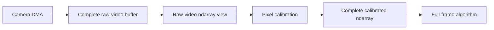
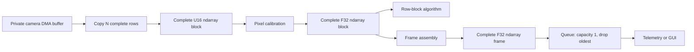

\page page_row_block_ndarrays Row-block ndarray processing

# Row-block ndarray processing

## Decision

Progressive camera work is represented as ordinary complete micro-buffers.
There is no progressively changing PipeWire buffer, progressive metadata, or
latest-buffer transport.

In eGrabber row-block mode, the camera DMA fills a private host buffer. The
source polls the camera's filled-size observation and copies each newly
complete group of `N` rows into a normal output buffer. That output is a
complete immutable U16 ndarray with shape `[N, width]`. A Calculon FGN pixel
calibration operator can consume those blocks immediately and emit complete
F32 row-block ndarrays. The generic `api.ndarray.frame-assembly` node restores
`[height, width]` frames for full-frame algorithms and observers.

The copy at the camera boundary gives each public artifact ordinary PipeWire
ownership. It removes the need to lease a buffer that the camera is still
changing.

## Topologies

Complete-frame mode preserves the camera's zero-copy path:



Row-block mode changes artifact granularity:



A source selects one output artifact contract for a configured port:

- `api.egrabber.output-mode = frame` publishes complete standard video
  buffers and may use direct camera buffers or DMA-BUF;
- `api.egrabber.output-mode = row-block` publishes complete raw ndarray
  blocks and uses private mapped camera storage plus one copy per block.

A source that accepts the row-block ndarray schema may also advertise a
complete-frame alternative. Format negotiation selects one exact shape for the
port. A single negotiated stream never mixes `[N, width]` and
`[height, width]` artifacts.

Packed complete-frame `GRAY8` or `GRAY16_LE` camera video crosses into the FGN
ndarray graph through `api.ndarray.video-view`. The adapter projects the exact
shape, rate, and schema and preserves bytes and Header metadata. Compatible SPA
allocation shares storage; the fallback is one packed-row copy. Row-block
sources already publish ndarrays and bypass it.

## Row quantum

`api.egrabber.row-block-rows = N` selects the public raw block height.
The Calculon FGN pixel-calibration port declarations and
`api.ndarray.row-block-rows = N` select the same calibrated block height and
assembly input. `N` must be positive, smaller than the detector height, and
divide the height. Exact shape, schema, layout, element type, and rate
negotiation rejects an inconsistent graph before processing starts.

For frame rate `F`, detector height `H`, and block height `N`:

```text
blocks_per_frame = H / N
block_rate = F * H / N
payload_bytes = N * line_stride
```

A smaller quantum exposes work sooner but raises scheduler, buffer, metadata,
copy-call, and algorithm overhead. A larger quantum amortizes overhead but
delays the first useful rows. The correct value is an empirical tradeoff
between readout cadence and downstream service time.

Each published block starts one ordinary graph cycle. A polling graph driver
does not publish the next block until the preceding synchronous cycle
completes. Camera DMA can continue meanwhile, so acquisition overlaps
calibration without overlapping public buffer ownership.

## Raw row-block contract

The raw schema identifier is
`org.calculon.ao.raw-pixel-row-block/1`. Its exact ndarray format is:

```text
mediaType    = application
mediaSubtype = ndarray
schema       = org.calculon.ao.raw-pixel-row-block/1
elementType  = U16_LE
shape        = [N, width]
layout       = ROW_MAJOR
rate         = frame_rate * height / N
```

The calibrated schema is
`org.calculon.ao.calibrated-pixel-row-block/1` with the same shape, layout,
and rate, but `F32_LE` elements. Each schema is the exact compatibility
identity for its detector-index interpretation: `offset` identifies the first
detector row, the leading array axis advances through contiguous detector
rows, and the trailing axis advances through detector columns. A different
detector ordering or coordinate interpretation requires a distinct versioned
schema. Device identity and a mutable calibration generation remain device,
construction, parameter, or per-buffer metadata; they are not silently folded
into the schema. Both schemas use ordinary `SPA_IO_Buffers`; a buffer is
immutable and complete when published.

## Frame and block identity

Every row-block buffer carries standard `SPA_META_Header` metadata:

| Field | Contract |
| --- | --- |
| `seq` | Stable frame or acquisition identity, equal for every block in one frame |
| `offset` | Zero-based first detector row in this block |
| `MARKER` | Set only on the block whose end is `height` |
| `DISCONT` | Set on the first block after loss, abort, invalid layout, or an abandoned frame |
| `CORRUPTED` | Set on the terminal block when the completed camera buffer is corrupt |
| `pts` | Completion timestamp when known; early camera blocks may use `SPA_TIME_INVALID` |

Blocks occur at offsets `0, N, 2N, ... height-N`. Consumers use `seq`,
`offset`, and `MARKER`; arrival time and graph cycle number are not frame
identity.

Acquisition metadata is copied to every block when a valid acquisition domain
is configured. A semantic multi-camera join still matches acquisition keys and
applies its own deadline, hold, and missing-input policy. Scheduler ordering
does not perform that join. See
[Acquisition identity and multi-host timing](acquisition-metadata.md) for the
shared-generation, PTP-time, wire, and join contract.

## eGrabber publication rules

For row-block mode:

1. `StartOfCameraReadout` associates the event with the oldest submitted
   private camera slot and establishes sequence/acquisition identity.
2. The source queries filled size and rounds down to a whole `N`-row prefix.
3. It publishes at most one not-yet-published block per `process()` call.
4. The final block is withheld until the terminal camera completion validates
   payload layout and supplies final status and timestamp.
5. The private camera slot is recycled only after the final block is copied, or
   after the frame is abandoned.
6. If no ordinary output buffer is available, the source abandons the
   remaining blocks and marks the next frame discontinuous.

Row-block mode requires the canonical row-block schema and
`StartOfCameraReadout`/filled-size support. Direct DMA-BUF row publication is
not used because the CPU must read the in-progress camera allocation. The
complete-frame mode remains the zero-copy and DMA-BUF option.

## Calibration and assembly

The Calculon FGN pixel-calibration operator accepts either:

- a complete U16 raw-detector ndarray, projected from packed `GRAY16_LE` by
  `api.ndarray.video-view`; or
- one complete raw row-block ndarray per graph cycle.

A node with frame-scoped calibration selection snapshots its selected
flat/background plan at the first block of a frame, so a new selection applies
to the next frame. The generated FGN declaration instead adopts a published
parameter plan at the next graph-cycle boundary, as required by the FGN
parameter contract. If that occurs after row zero, it marks the first block
using the new plan `DISCONT`; frame aggregators then abandon the mixed partial
frame and publish nothing until a complete frame uses one plan. In row-block
mode calibration consumes the raw block after producing the corresponding
calibrated block; no camera lease crosses the node.

`api.ndarray.frame-assembly` is a structural ndarray transform. Its input port
advertises the exact row-block format and the exact complete-frame format;
negotiation selects one for the stream. One prepared instance owns a
preallocated byte workspace for the negotiated element type, layout, block
shape, complete-frame shape, and every present rate and schema field.
It accepts clocked or unclocked standard fixed-width rank-two ndarrays in
row-major or column-major layout without interpreting or converting element
values. For row blocks it accepts only the next expected offset for the active
sequence. A gap, overlap, changed sequence, out-of-range block, or invalid
marker abandons the partial frame. It publishes nothing until the final valid
block arrives. Non-marker Header flags accumulate across accepted blocks, and
the next completed frame after an abandonment carries `DISCONT`.

A complete-frame input is already a complete artifact. Its exact output format
and Header are preserved; `offset` and `MARKER` are not interpreted. When SPA
buffer allocation negotiation supplies shared input/output storage, the
payload is forwarded without a copy. Otherwise it is copied directly once
without using the assembly workspace.

Consumers that understand row blocks can branch before assembly. Full-frame
algorithms, telemetry, GUI, recording, and standard video conversion normally
branch after assembly.

A capacity-one observer queue after assembly bounds backlog but does not lower
the assembly rate. A lower-rate observer path requires explicit frame-aware
rate selection before payload assembly. Selection retains or discards every
block with the same Header `seq` as a group; dropping individual blocks is not
a rate conversion.

## Conditional scientific aggregation

An FGN node that consumes row blocks and produces one frame-rate artifact is
an explicit rate-changing aggregator. Its input format uses the block rate and
its output format uses the frame rate. The two sides do not link directly to
ports with unequal rates; the aggregator is the declared scientific boundary
that relates them.

The aggregator declares its output conditional. On a nonterminal block it
returns success with output size zero. The graph treats that artifact as
absent, skips required consumers, and retains any unpublished external output
buffer. On the terminal block it publishes a complete artifact and only then
does the frame-rate suffix execute. No changing or partial output buffer is
visible outside the aggregator.

The row-block Shack–Hartmann/reconstructor composition uses a private detector
frame, measurement workspace, and reconstruction accumulator. Uniform
subaperture size is construction configuration. Every subaperture has an
explicit zero-based origin, and declaration order remains the slope and
reconstructor-column order. A separate prepared schedule sorts subapertures by
the row at which they become complete. The implementation may process only the
greatest ready prefix in scientific order; unusual origin order can delay work
but cannot reorder coordinates.

For each admitted block, the composition copies pixels into private frame
storage, measures newly ready subapertures, and accumulates only their
reconstructor columns. It publishes the reconstructed vector after the final
contiguous block. A gap, overlap, sequence change, invalid terminal marker,
mid-frame discontinuity, out-of-range block, or corrupt block abandons private
state and publishes nothing. The next complete result carries `DISCONT`, even
when the loss was detected inside the graph rather than by the source.

The row-block pyramid composition uses the same block identity and recovery
rules. It owns a private detector frame and complete pupil-major output. It
processes only the greatest complete pupil prefix in declared pupil order, so
arbitrary explicit pupil origins cannot change scientific output or
full-pupil accumulation order. Both the normalized reconstruction-pixel array
and current mean-pupil-intensity scalar are conditional and publish together
on the terminal block.

Pyramid normalization remains stateful across completed frames. The first
frame uses zero gain. A later frame uses the reciprocal mean committed by the
preceding successful frame. Dropped frames and compatible mid-frame plan
updates abandon private partial work but preserve that committed gain; the
next complete output is discontinuous. An explicit algorithm reset returns
the gain to its zero-startup state.

This front end can feed a separate frame-rate controller graph. That split
keeps one row-block activation per immutable input block while avoiding
retention of frame-rate feedback inputs across the intervening block cycles.
An end-to-end graph that crosses that rate and feedback boundary requires an
explicit delay/holding operation with defined reset, loss, and rollback
semantics; conditional publication alone does not invent those semantics.

## Observer isolation

A non-real-time observer must not retain an RTC-owned pool indefinitely. Put a
bounded queue at the observer branch. The recommended default is capacity one
and `drop-oldest`.

- Lease storage is zero-payload-copy but one retained buffer remains unavailable
  to the upstream pool until replaced or consumed.
- Copy storage copies once into an observer-owned pool and completely decouples
  upstream buffer reuse.

Both policies are explicit overload boundaries. Neither changes scheduler
dependency semantics inside the synchronous RTC graph.

## Scheduling and wake policy

Row-block and full-frame modes use the same ordinary scheduler. Either can
signal an eventfd-driven downstream loop or a polling downstream loop.
`SPA_NODE_FLAG_POLL_DRIVER` changes how a source discovers and starts a
quantum; `loop.idle` changes how the destination waits for activation. Neither
changes the ndarray format or buffer ownership.

This design removes the obsolete progressive metadata, latest-buffer
transport, per-node RTC process flag, and private RTC data loop. The remaining
PipeWireAO core extensions are the ndarray format, acquisition metadata,
polling data-loop wake policy, polling driver flag, and cross-process polling
activation bit.
