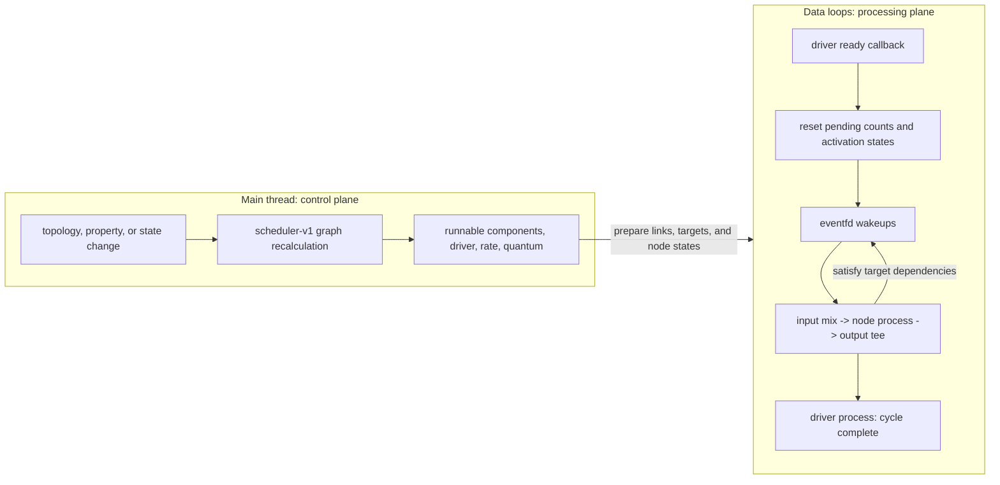
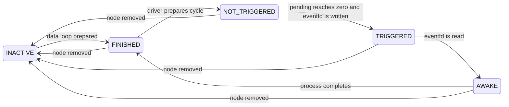
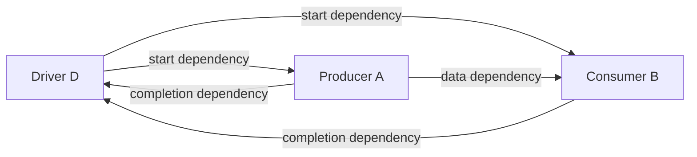
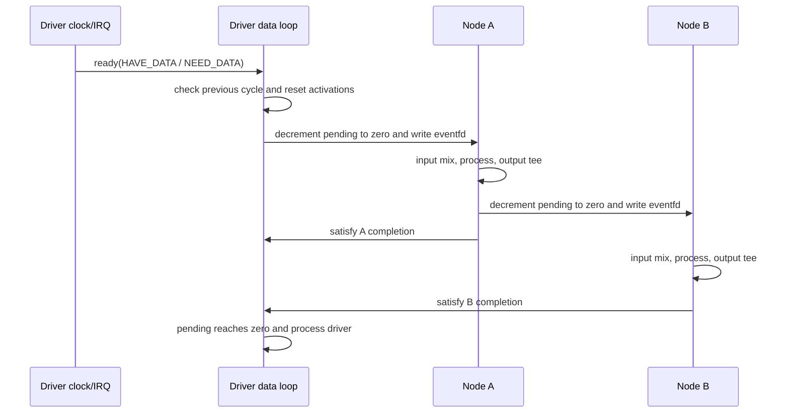

\page page_scheduling_detail PipeWire graph scheduling in detail

# PipeWire graph scheduling

This document describes the regular PipeWire graph scheduler as implemented by
upstream `origin/master` at commit
`69187d4cdfbb1ddd502e315faa1f4e883e3189a1` (2026-08-24). It expands the
older [`scheduling.dox`](scheduling.dox) overview by connecting graph
recalculation, driver selection, activation records, data-loop execution,
remote nodes, lazy scheduling, and ASYNC operation.

Except for paragraphs explicitly labeled as PipeWireAO extensions, the
description is intentionally about that upstream commit. The polling
extensions are labeled explicitly.

## Executive model

PipeWire scheduling has two distinct halves:

1. On the main thread, `module-scheduler-v1` repeatedly derives a runnable
   graph from nodes, prepared links, passive-port rules, groups, and node
   properties. It assigns each runnable component to one driver, chooses the
   graph rate and quantum, and starts or idles nodes in dependency-safe order.
2. On data-loop threads, the selected driver starts each cycle. Shared
   activation records and eventfds implement a distributed countdown graph:
   completing a node atomically satisfies its consumers' dependencies, and a
   node is woken when its dependency count reaches zero.

The server does not call every client through an IPC round trip. Activation
records are shared with remote clients, and peers receive one another's
eventfds, so a client can wake another client directly.

## Terminology

- A **node** is a SPA processing object with zero or more input and output
  ports.
- A **prepared link** has negotiated a format and buffers and has reached at
  least the paused state. Only prepared links can become active.
- An **active node** is enabled by the client or session manager. Active does
  not necessarily mean runnable or running.
- A **runnable node** participates in useful data flow during the current
  graph configuration.
- A **driver candidate** has `node.driver = true`. The selected **driver** for
  a component supplies its clock and initiates graph cycles. Other nodes in
  that component are **followers**, including unselected driver candidates.
- A **target** is a scheduling edge from a node that will finish work to a node
  whose dependency counter it will decrement.
- A **quantum** is the number of samples or frames processed per graph cycle.
- A **data loop** is the thread and event loop on which a local node is
  processed. Several nodes may share a data loop; dependencies may also cross
  data loops and processes.

The terms *active*, *runnable*, *running*, and *triggered* describe different
states and should not be used interchangeably.

## Implementation map

The principal upstream sources are:

| Responsibility | Source |
| --- | --- |
| Load the default scheduler module | [`src/daemon/pipewire.conf.in`](https://gitlab.freedesktop.org/pipewire/pipewire/-/blob/69187d4cdfbb1ddd502e315faa1f4e883e3189a1/src/daemon/pipewire.conf.in) |
| Recalculate runnability, components, drivers, rate, quantum, lazy mode, and node states | [`src/modules/module-scheduler-v1.c`](https://gitlab.freedesktop.org/pipewire/pipewire/-/blob/69187d4cdfbb1ddd502e315faa1f4e883e3189a1/src/modules/module-scheduler-v1.c) |
| Manage activation targets, eventfds, node lifecycle, driver cycles, processing, and xrun recovery | [`src/pipewire/impl-node.c`](https://gitlab.freedesktop.org/pipewire/pipewire/-/blob/69187d4cdfbb1ddd502e315faa1f4e883e3189a1/src/pipewire/impl-node.c) |
| Define activation records and target-trigger operations | [`src/pipewire/private.h`](https://gitlab.freedesktop.org/pipewire/pipewire/-/blob/69187d4cdfbb1ddd502e315faa1f4e883e3189a1/src/pipewire/private.h) |
| Build link dependencies, choose normal or ASYNC I/O, and negotiate buffers | [`src/pipewire/impl-link.c`](https://gitlab.freedesktop.org/pipewire/pipewire/-/blob/69187d4cdfbb1ddd502e315faa1f4e883e3189a1/src/pipewire/impl-link.c) |
| Copy link I/O using the current cycle slot and propagate ASYNC link latency | [`src/pipewire/impl-port.c`](https://gitlab.freedesktop.org/pipewire/pipewire/-/blob/69187d4cdfbb1ddd502e315faa1f4e883e3189a1/src/pipewire/impl-port.c) |
| Export activations, peer eventfds, and per-link I/O to clients | [`src/modules/module-client-node/`](https://gitlab.freedesktop.org/pipewire/pipewire/-/tree/69187d4cdfbb1ddd502e315faa1f4e883e3189a1/src/modules/module-client-node) |
| Define normal and double-slot buffer I/O | [`spa/include/spa/node/io.h`](https://gitlab.freedesktop.org/pipewire/pipewire/-/blob/69187d4cdfbb1ddd502e315faa1f4e883e3189a1/spa/include/spa/node/io.h) |

Related upstream prose is split across
[`running.dox`](running.dox), [`driver.dox`](driver.dox), and
[`latency.dox`](latency.dox).

## Control-plane graph recalculation

The default daemon configuration loads
`libpipewire-module-scheduler-v1` unless `module.scheduler-v1 = false`. The
module listens for the context's `recalc_graph` event.

Recalculation occurs after relevant changes, including:

- node registration, activation, deactivation, destruction, or scheduling
  property changes;
- a link becoming prepared or unprepared, or being destroyed; and
- global clock settings changing.

The context can freeze and thaw recalculation while a compound update is in
progress. A request made while recalculation is frozen or already running is
coalesced and replayed afterward. Recalculation therefore observes complete
control-plane changes rather than every transient intermediate state.

### Stage 1: find runnable nodes

At the start of every pass, the scheduler clears temporary `visited`,
`checked`, and `runnable` state. Exported nodes and inactive nodes do not seed
the runnable search.

A node becomes runnable when one of these conditions applies:

- `node.always-process = true`;
- it participates in a prepared active link whose port-passive combination
  seeds runnability; or
- a runnable node propagates runnability to it through a non-fully-passive
  peer port, `node.group`, or `node.link-group`.

`node.always-process` also implies `node.want-driver`.

PipeWire has four effective per-port passive modes:

| Mode | Seeds a runnable pair? | Becomes runnable from a runnable peer? |
| --- | --- | --- |
| `false` | Yes | Yes |
| `true` | No | No |
| `follow` | No | Yes |
| `follow-suspend` | Only when both ends are `follow-suspend` | Yes |

The `follow-suspend` pair exception allows, for example, a manually linked
device source and device sink to activate one another. Media classes containing
`Sink`, `Source`, or `Duplex` default to `follow-suspend`; other nodes default
to `false` unless `node.passive` or `port.passive` says otherwise.

The initial seed test and propagation test are deliberately different. A
`follow` port does not start a graph by itself, but it follows a peer that was
made runnable for another reason. A `true` port does neither.

Preparing a link is part of the runnable search. If negotiation has not
finished, the link does not make its nodes runnable yet.

### Stage 2: form scheduling components and select drivers

Component membership follows all graph links and these explicit relations:

- `node.group`: nodes must be scheduled together;
- `node.link-group`: the same scheduling grouping, plus a declaration that the
  nodes are internally linked, which helps the session manager avoid loops;
- `node.sync-group`: joins matching groups only when a member has
  `node.sync = true`. Unlike `node.group`, it does not by itself make a node
  runnable.

Component collection follows links even when a node or link is currently
inactive. This keeps driver assignment stable; runnability remains a separate
decision based on active, prepared data flow.

Driver candidates are kept in descending `priority.driver` order. Starting
from those candidates, the first candidate that reaches a component becomes
its driver, so the highest-priority candidate normally wins. At zero priority,
lazy/request capability also influences ordering. Assigning a driver gives
every follower the driver's shared `SPA_IO_Position` and records the selected
driver in `node.driver-id`.

If an otherwise unassigned runnable component contains an active
`node.want-driver` node, or any `node.always-process` node, the scheduler moves
it to a fallback active driver. The fallback choice is an implementation
detail, not a stable selection API.

Without a usable driver, the component is detached from graph scheduling and
its nodes are moved out of the running state.

### Stage 3: choose rate and quantum

The scheduler evaluates each selected driver's follower list and derives one
rate and one quantum for the whole component.

The important precedence rules are:

1. Global forced clock settings override node suggestions.
2. Among node-level `node.force-rate` or `node.force-quantum` requests, the
   most recently changed value wins.
3. A force overrides the corresponding lock. Otherwise `node.lock-rate` and
   `node.lock-quantum` preserve the current value when applicable.
4. Suggested `node.rate`, `node.latency`, and `node.max-latency` values are
   combined across followers. The scheduler prefers the highest requested
   rate and the smallest requested latency.
5. The result is restricted to allowed rates and the configured quantum
   minimum, maximum, floor, and limit. If power-of-two quantum mode is enabled,
   an unforced result is rounded down to a power of two.

Rate selection prefers a permitted rate at or above the request with a useful
greatest-common-divisor relationship, avoiding excessive upsampling. It next
tries the nearest higher rate, a reasonable related downsample rate, and
finally the highest available rate.

Pending values are published into `spa_io_clock.target_rate` and
`target_duration` under a sequence counter. A driver adopts them at a cycle
boundary. Changes that cannot safely happen live suspend and reconfigure the
component, then restart graph evaluation.

### Stage 4: transition node states

Followers are moved toward their target state before the driver. This matters
because a driving node deliberately waits for all followers to finish their
Start transitions before it receives Start and begins producing cycles.

A node becomes `RUNNING` only when it is active, runnable, configured, and its
component is running. A configured non-running follower is normally `IDLE`.
Properties such as `node.pause-on-idle` and `node.suspend-on-idle` determine
whether the implementation is paused or suspended as it becomes idle.

## Runtime representation

### Activation record

Each node has a `pw_node_activation` record allocated in shared memfd-backed
memory and an eventfd used to wake its data loop. The scheduling-critical part
is `state[0]`:

| Field | Meaning |
| --- | --- |
| `required` | Stable number of active scheduling signals required by the node |
| `pending` | Per-cycle countdown, reset from `required` at cycle start |
| `status` in `state[0]` | Result returned by the last SPA `process()` call |
| top-level `status` | Activation lifecycle state used with atomic compare-and-swap |

The record also contains signal, wake, and finish timestamps; driver position
and clock data; transport and reposition state; profiler load and xrun data;
driver identifiers; version fields; and ASYNC/profiler flags.

The activation lifecycle is:

- `INACTIVE` means the event source must not be scheduled.
- `FINISHED` means the previous invocation is complete.
- The driver changes eligible targets to `NOT_TRIGGERED` while preparing a
  cycle.
- The atomic decrement that makes `pending == 0` changes the target to
  `TRIGGERED`, records `signal_time`, and writes its eventfd.
- Reading the eventfd and winning the CAS to `AWAKE` grants one invocation of
  the node process path.
- Completion records the result and time and changes `AWAKE` to `FINISHED`.

The compare-and-swap transitions prevent a late completion from overwriting a
newer activation after xrun recovery or ASYNC rescheduling.

### Target edges and de-duplication

A `pw_node_target` contains the target activation pointer, target eventfd,
system interface, node ID, and version-specific trigger function. An active
target normally contributes one to the target's `required` and `pending`
counters.

Multiple port links from the same output node to the same input node share one
reference-counted node peer. They therefore create one scheduling dependency,
not one dependency per channel or port.

For a normal data link `A -> B`, `A` owns a target for `B`, so `B` waits for
`A`. A feedback link reverses the scheduling peer to keep the activation graph
acyclic and moves feedback data across a cycle boundary.

Driver assignment conceptually adds both directions for every follower `N`:

- `driver -> N` lets the driver release `N` at cycle start; and
- `N -> driver` makes graph completion wait for `N`.

Targets are de-duplicated by source and target node. If a data edge already
has the same direction as a driver edge, the two references share one target
and contribute one dependency.

Preparing a local node adds its event source to its data loop, marks its
activation `FINISHED`, and activates all its targets. Removing it first marks
it `INACTIVE`, then releases its target contributions. If it was removed while
work was pending, the server also satisfies affected dependencies so the rest
of the graph cannot deadlock behind a disappearing node.

## One synchronous graph cycle

A driver uses a hardware interrupt, timer, network timing source, or explicit
trigger to decide when a cycle begins. Before calling its ready callback, it
updates the shared `spa_io_clock`, including `nsec`, `position`, `duration`,
`rate`, `rate_diff`, and `next_nsec`. See [`driver.dox`](driver.dox) for the
clock contract.

The current `node_ready()` path performs these operations:

1. Verify that the previous cycle completed. If it did not, record an xrun and
   run recovery so stale work cannot block the new cycle.
2. Consume pending transport and reposition commands and gather segment-owner
   updates.
3. For every active driver target, copy `required` into `pending`, change its
   activation to `NOT_TRIGGERED`, and preserve profiling timestamps. A target
   still `TRIGGERED` or `AWAKE` is recorded as late.
4. Set the driver's own `pending` count to the number of synchronous targets
   that must finish the cycle.
5. Update transport position and transport-sync state.
6. If the driver already has output data, run its output tees before advancing
   the cycle counter. This ordering is significant for ASYNC consumers.
7. Increment `spa_io_clock.cycle`, emit the graph-start profiler event, and
   trigger every target on the driver's target list.

Triggering is an atomic decrement. Independent branches whose counters reach
zero can run in parallel on different data loops. A linear consumer remains
blocked until every distinct synchronous producer has signaled it.

### Processing a node

The node eventfd callback reads and coalesces its wake count, then tries the
`TRIGGERED -> AWAKE` transition. The winner executes:

1. each input-port mixer, which copies the selected link I/O into the node's
   input I/O;
2. the SPA node's `process()` method; and
3. when the node reports `SPA_STATUS_HAVE_DATA`, each output-port tee, which
   copies the node's output I/O to its links.

After recording `FINISHED`, an ordinary follower triggers all its targets. The
selected driver is different: its process invocation is the completion fence,
so it calculates graph CPU-load statistics and emits completion instead of
triggering another round.

The dependency graph is topological, but it is not a centralized work queue.
Its ready queue is the set of eventfds whose atomic dependency countdowns have
reached zero.

### Xruns and recovery

If the next driver ready callback arrives before the driver activation reached
`FINISHED`, PipeWire forces the driver completion path so the new cycle can be
initialized. A driver already `TRIGGERED` has received every dependency but
has not yet run; PipeWire completes it inline without reporting an incomplete
graph. Other unfinished states are graph xruns: PipeWire reports incomplete
work. The forced completion is wrapped in
`SPA_IO_CLOCK_FLAG_XRUN_RECOVER` in either case. Targets left `TRIGGERED` or
`AWAKE` receive their own xrun accounting.

An eventfd read greater than one means wakeups accumulated before the node ran;
PipeWire reports the missed wakeups and increments xrun statistics. The
profiler fields retain signal-to-awake wait time and awake-to-finish process
time, which is how tools can separate scheduling delay from processing cost.

## ASYNC scheduling

ASYNC mode removes selected completion dependencies and uses two cycle-indexed
I/O slots so nodes that are no longer ordered cannot concurrently access the
same link state. It is intended for work that cannot guarantee the graph's
real-time deadline, such as a callback dispatched to a non-real-time main
loop or processing that offloads to another worker.

The trade is explicit: the synchronous graph can complete without waiting for
the ASYNC node, while most ASYNC links add one quantum of pipeline latency and
may skip or overwrite time-adjacent work if the node falls behind.

### Three meanings of “async”

PipeWire uses similar names for three different mechanisms:

| Mechanism | Meaning | Direct graph-scheduling effect |
| --- | --- | --- |
| `node.async = true` | Select ASYNC graph scheduling for this node | Yes: changes target dependencies, driver completion, and eligible link I/O |
| `SPA_NODE_FLAG_ASYNC`, `PW_STREAM_FLAG_ASYNC`, or `PW_FILTER_FLAG_ASYNC` | The SPA process/buffer contract may complete work away from its real-time callback; request extra buffer capacity | Not by itself; the graph scheduler reads `node.async` |
| `SPA_RESULT_IS_ASYNC()` and `SPA_RESULT_RETURN_ASYNC()` | An API method will return its result later, identified by a sequence number | None; this is control/API completion, not graph processing |

For `pw_stream` and `pw_filter`, omitting the `RT_PROCESS` flag automatically
sets `node.loop.class = main` (unless overridden) and `node.async = true`.
The explicit stream/filter `ASYNC` flag sets the SPA node flag used by buffer
handling. A real-time stream that needs graph-level decoupling must also expose
`node.async = true`.

`node.async` is forcibly disabled when `node.driver = true`, even if that
candidate is currently a follower. A driver must remain a synchronous cycle
boundary.

`link.async` is derived by the core; it is not the switch that enables ASYNC
scheduling. A link is marked ASYNC when either endpoint has graph ASYNC enabled
and both ports advertise `SPA_IO_AsyncBuffers` support. A direct reliable
driver-to-follower link can still use ordinary `SPA_IO_Buffers` at activation
time because the driver is known to run first.

### Exact activation-v1 dependency rules

The current implementation is more precise than the broad statement that an
ASYNC node “has no dependencies.” The code suppresses a dependency according
to the **source that would signal it**:

- When a synchronous node activates target `T`, it increments `T.required`.
- When an ASYNC node activates target `T`, it does not increment
  `T.required`.
- A synchronous follower triggers its targets after processing.
- An ASYNC follower using activation version 1 does not trigger its targets
  after processing.
- At cycle start, the driver does not count an ASYNC target in the driver's own
  completion `pending` count.
- The driver still triggers every ASYNC follower each cycle. This is the
  minimum incoming dependency that releases the follower.

Consequently, an ASYNC producer is not a prerequisite for its consumers, and
an ASYNC follower is not a prerequisite for graph completion. However, an
ASYNC node can still wait for a distinct synchronous upstream producer because
that producer contributes an incoming dependency to the ASYNC node.

For a data link `U -> V`, ignoring other inputs:

| `U` | `V` | Does `V` wait for `U`? | Does graph completion wait for `U`? | Link data seen by `V` |
| --- | --- | --- | --- | --- |
| sync | sync | Yes | Yes | Current cycle |
| ASYNC | sync | No | No | Previous ASYNC slot |
| sync | ASYNC | Yes, unless `U` is the same de-duplicated driver target | Yes | Previous ASYNC slot, after `U` finishes |
| ASYNC | ASYNC | No | No | Previous ASYNC slot |

The common all-ASYNC chain therefore releases every member from the driver at
cycle start and lets them run independently. A mixed graph may retain some
incoming ordering even though the ASYNC link's double slots already protect
buffer exchange. This is observable activation-v1 behavior in
`activate_target()` and `process_node()`, and is an important qualification to
the simplified legacy description.

### Double-slot buffer exchange

`spa_io_async_buffers` contains two `spa_io_buffers` records. Port code maps
the same cycle index differently by direction:

- an output writer for cycle `k` writes physical slot `(k + 1) & 1`;
- an input reader for cycle `k` reads physical slot `k & 1`.

The writer's result is therefore the reader's input in cycle `k + 1`:

| Graph cycle | Reader slot | Writer slot | Writer result becomes readable |
| --- | --- | --- | --- |
| `0` | `0` | `1` | cycle `1` |
| `1` | `1` | `0` | cycle `2` |
| `2` | `0` | `1` | cycle `3` |

This is double-buffered I/O state, not necessarily two fixed payload memory
blocks. Each slot is a `spa_io_buffers` status and buffer-ID exchange; the
negotiated buffer pool supplies the actual payload buffers. The core buffer
negotiation path requests extra capacity for asynchronous use, and the audio
and video adapters explicitly clamp ASYNC negotiation to at least two buffers.

Because readers and writers select different slots during one cycle, they can
run concurrently without racing the same I/O record or payload lease. Every
ordinary ASYNC link adds one quantum to both the scheduling pipeline and the
reported `SPA_PARAM_Latency` path.

### Driver-output exception

The driver has a special ordering rule. When its ready status contains
`SPA_STATUS_HAVE_DATA`, PipeWire copies driver output through the output tee
*before* incrementing the cycle number. If the old cycle is `k - 1`, the output
writer selects physical slot `k & 1`; after the increment, ASYNC followers in
cycle `k` read that same slot. Driver-produced data is therefore available
immediately and no extra quantum is reported for an ASYNC link directly from
the selected driver.

If that driver is marked `node.reliable = true`, a direct driver-to-follower
link bypasses double-slot I/O and uses ordinary `SPA_IO_Buffers`. The known
driver-before-follower order prevents concurrent access, while reliable tee
semantics avoid out-of-order buffer recycling after a stall.

### What happens when an ASYNC node is late

ASYNC removes the node from the driver's completion fence; it does not give the
node unlimited queueing or a second process owner.

At the next cycle, the driver inspects and resets every target activation. An
ASYNC target still `TRIGGERED` or `AWAKE` receives xrun accounting, but the
driver continues, changes it to the new cycle's state, and can queue another
eventfd wakeup. The activation compare-and-swap prevents the previous
invocation's late finish from marking the newer activation `FINISHED`.

The node's own data-loop callback remains serialized. If wakes accumulate, the
eventfd count exposes missed cycles. An underlying SPA implementation may also
have its own worker, but its synchronization and bounded-work behavior are
outside the graph scheduler.

Operational consequences include:

- the real-time graph is insulated from the ASYNC node's completion time;
- downstream nodes inspect only the cycle-selected slot, which may contain
  data or report that no data is ready; the link is not an unbounded FIFO of
  every ASYNC result;
- a slow ASYNC node can miss cycles and report xruns without causing a graph
  xrun by itself; and
- each consecutive ASYNC link adds another quantum, so an ASYNC chain is a
  pipeline rather than a same-cycle topological evaluation.

Use ASYNC when isolation is worth those semantics. It is not a way to make a
long synchronous algorithm meet the same-cycle deadline without changing
latency or overload behavior.

## Explicit triggering

`node.trigger = true` adds one extra required activation signal. Driver and
producer signals alone cannot make the node runnable for a cycle; an explicit
trigger, such as `pw_stream_trigger_process()`, must satisfy the extra count.
This is useful when a node's output depends on an application-controlled event
or another stream.

Explicit triggering is orthogonal to ASYNC. It adds an incoming dependency;
ASYNC controls which outgoing completion dependencies exist and whether the
driver waits for the node.

## Lazy scheduling

Lazy scheduling controls **when the driver starts a cycle**, not dependency
ordering inside a started cycle.

A follower with `node.supports-request > 0` can emit a SPA `RequestProcess`
event. The server converts it to a `RequestProcess` command for the selected
driver. A driver with `node.supports-lazy > 0` may use those requests when
deciding whether a cycle is worthwhile. The scheduler sets
`SPA_IO_CLOCK_FLAG_LAZY` only when a running component contains at least one
request-capable follower and its driver supports lazy operation.

The numeric values express increasing preference. They also help order
zero-priority driver candidates so a compatible lazy driver can be paired with
a requesting follower.

Typical patterns are:

- a conventional producer driver runs whenever a new frame arrives;
- a lazy consumer driver waits for a request-capable producer to announce that
  work exists, then applies its own refresh rhythm; or
- a lazy producer driver runs when a request-capable consumer is ready to pull
  another frame.

Lazy and ASYNC can coexist. Lazy mode can suppress unnecessary cycles, while
ASYNC mode changes which processing completions gate the cycles that do run.

## Remote and exported nodes

For a client node, the server allocates or imports its activation record and
passes the client:

- its own activation memfd mapping and process eventfd;
- the activation mapping and eventfd for each peer target; and
- the selected driver's shared position/clock area.

The client reconstructs the same target list locally. A remote follower can
therefore decrement and wake a peer or the driver directly after processing,
without routing the real-time edge through the server main loop. Atomic
activation state remains the cross-process synchronization contract.

PipeWireAO extension: a version-1 activation owner can set
`PW_NODE_ACTIVATION_FLAG_POLLING` in that shared record. Updated producers then
publish `TRIGGERED` without writing the target eventfd. The exported
implementation's polling data loop observes the same activation mapping and
calls `process()` after claiming `TRIGGERED -> AWAKE`. Wake policy is per
target, so polling and eventfd clients can coexist in one graph. An older
producer remains correct but continues to write the eventfd because it does not
recognize the polling flag. See \ref page_polling_data_loops for the complete
extension contract.

A remote driver starts its graph directly in its client data loop. It signals
the server after completion only when profiling requires that notification.
The scheduler has compatibility trigger functions for activation version 0,
but version 1 adds compare-and-swap activation transitions and the current
ASYNC behavior.

During teardown, the server marks a remote activation inactive and satisfies
pending peer dependencies defensively. This prevents a crashed or disconnected
client from leaving the remaining graph permanently blocked.

## Scheduling invariants

The implementation relies on these invariants:

1. Exactly one selected driver initiates cycles for a scheduling component.
2. A driver is synchronous, even if its node implementation can otherwise
   offload work.
3. Each distinct source-target node pair contributes at most one target,
   regardless of its number of port links.
4. `required` changes only while target topology is prepared or unprepared;
   each cycle resets `pending` from it before releasing work.
5. A normal node processes only after winning `TRIGGERED -> AWAKE`.
6. A synchronous follower signals its targets only after input mixing, node
   processing, and any output tee have completed.
7. Graph completion means all synchronous targets completed. It says nothing
   about ASYNC targets still in flight.
8. An ASYNC link uses disjoint read/write cycle slots, except for a direct
   reliable driver link whose execution order makes ordinary I/O safe.
9. The shared driver clock and position are updated at cycle boundaries and
   are visible to every follower assigned to that driver.
10. Removing a node cannot leave an unsatisfied dependency behind.

These invariants explain both the scheduler's low steady-state overhead and
why topology and target mutations are synchronized onto data loops rather than
performed directly by arbitrary control-plane code.

## Observability and debugging

Useful externally visible state includes:

- `node.driver`, `priority.driver`, and derived `node.driver-id`;
- `node.async` and derived `link.async`;
- `node.group`, `node.link-group`, `node.sync-group`, and `node.sync`;
- `node.latency`, `node.rate`, lock/force properties, and the driver's current
  rate and quantum; and
- profiler activation timestamps, CPU load, xrun count, and xrun delay.

`pw-top` displays followers beneath their driver with `+`; ASYNC followers use
`=`. Its driver wait and quantum timing summarize whole-graph load, while a
follower's wait-versus-busy timing helps distinguish wake-up delay from node
processing cost. `pw-profiler` exposes the underlying activation and clock
measurements in more detail.

When diagnosing a graph, check in this order:

1. Is the link prepared and are both intended endpoints active?
2. Do passive-port rules make the component runnable?
3. Which driver was selected, and did grouping join more nodes than expected?
4. What rate and quantum did the driver publish?
5. Which target remains `TRIGGERED` or `AWAKE` at the next cycle?
6. Is `node.async` actually set, or is only a similarly named SPA/API ASYNC
   flag present?
7. Does every derived ASYNC link support double-slot I/O, and is an expected
   quantum of latency visible in the propagated latency parameters?

That sequence separates control-plane configuration failures from data-plane
deadline failures and from ASYNC pipeline behavior.
