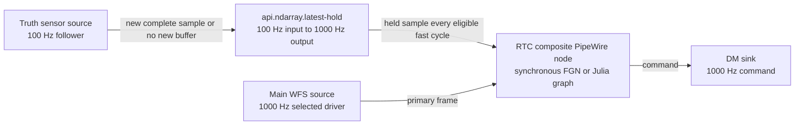

\page page_simple_multirate_ndarrays Simple multirate ndarray processing

# Simple multirate ndarray processing

## Status and decision

This document defines the smallest PipeWire-native design needed for a slow
measurement used by a faster adaptive-optics loop. The node and adapter work
described below is implemented. A focused native/Julia live fixture qualifies
the baseline follower topology; broader lifecycle, pool-replacement, timing,
and hardware qualification remain separate acceptance gates.

The first and only planned rate-transition policy is one ordinary PipeWire SPA
node that implements latest/hold:

```text
slow input at its real rate -> latest/hold -> held output at the fast rate
```

The node retains the newest accepted PipeWire input-buffer lease. The selected
fast PipeWire driver schedules it as a follower. Matching output buffers alias
the negotiated input payload storage, so each eligible fast graph cycle
publishes that retained value without copying its payload. Native FGN and
JuliaFilterGraph then consume ordinary equal-rate inputs; neither backend
implements another latest/hold policy on this path.

This is intentionally similar to the practical CACAO and HEART pattern in
which a high-rate loop reads the current value of a slower stream. PipeWire
remains the only scheduler and makes the rate transition an explicit,
inspectable graph node.

Exact multi-camera acquisition joining is not part of this delivery. Its
identity contract remains defined by \ref page_acquisition_metadata and should
be implemented only for a selected consumer that requires it.

## Goals

- Expose the slow and fast rates truthfully on ordinary PipeWire ports.
- Use one PipeWire driver or cadence owner for the connected scheduling
  component.
- Retain exactly one slow value with deterministic freshness and failure rules.
- Give native FGN and JuliaFilterGraph the same behavior through one shared
  PipeWire node.
- Perform no allocation, blocking wait, private scheduling, or unbounded work
  on the repeated processing path.
- Copy only bounded Header, chunk, and Acquisition metadata; never copy the
  ndarray payload on admission or publication.

## Non-goals

- A general multirate graph scheduler or resampler.
- Temporal-policy modes or dynamically loadable policy plugins.
- Queues between numerical algorithms.
- Exact acquisition joins, timestamp rendezvous, or reorder windows.
- Inferring scientific interpolation, integration, averaging, or decimation.
- A cross-host wire protocol.
- Guaranteeing simultaneous physical actuator application.
- Replacing PipeWire driver selection with an RTC scheduler.

## Proposed topology

The first supported topology is a 1000 Hz primary loop using a 100 Hz retained
measurement:



The main WFS, latest/hold node, processing composite, and actuator participate
in one PipeWire scheduling component with one selected 1000 Hz driver. The slow
source is a nonblocking follower. When asked to process without a newly complete
sample, it completes that requested graph cycle promptly without publishing an
input buffer: its output `spa_io_buffers` remains `SPA_STATUS_NEED_DATA` and its
process method returns `SPA_STATUS_OK`. It must not publish an empty
`SPA_STATUS_HAVE_DATA` buffer as a generic no-data token. The hold node treats
the absence of an input buffer as no update, without invalidating the retained
value or renewing its age. The selected source plugin must demonstrate this
behavior; a rate declaration alone does not provide it.

An independently triggered source does not automatically cause a processing
callback merely because its port declares a different rate. The first
deployment relies on the selected fast driver's cycles to observe slow-source
progress. A slow acquisition completed between cycles may therefore wait until
the next fast cycle. RequestProcess or ASYNC behavior is not added unless a
selected source demonstrates that the follower arrangement is insufficient.

## Why this is a PipeWire node

The latest/hold boundary changes an external stream from one published rate to
another. Representing it as a PipeWire node provides:

- exact input and output format negotiation;
- visible 100 Hz and 1000 Hz port rates;
- normal PipeWire driver/follower scheduling;
- ordinary buffer-pool backpressure and lifecycle;
- standard latency propagation and graph introspection; and
- one implementation shared by native and Julia processing composites.

Keeping latest/hold inside each numerical backend would hide the external rate
mapping, duplicate semantic state, and conflict with FGN's synchronous
equal-input-rate contract. The separate node uses ordinary negotiated buffer
sharing and leases while keeping the rate transition visible.

## Node contract

The proposed factory is `api.ndarray.latest-hold` in the out-of-tree generic
ndarray SPA plugin. It has one ndarray input and one ndarray output. Shape,
element type, layout, and schema match exactly; the configured input and output
rates differ.

The node-owned construction surface contains only these exact properties.
Ordinary PipeWire host properties such as `node.name`, `factory.name`, and
`library.name` are accepted by the factory; unknown keys in the
`api.ndarray.*` namespace are rejected:

| Property | Value |
| --- | --- |
| `api.ndarray.element-type` | Existing fixed ndarray element-type spelling |
| `api.ndarray.shape` | Nonempty bracketed positive decimal extents in axis order |
| `api.ndarray.layout` | Existing `row-major` or `column-major` spelling |
| `api.ndarray.schema` | Optional nonempty exact schema; absence means schema-less |
| `api.ndarray.input-rate` | Required positive `u32/u32` fraction |
| `api.ndarray.output-rate` | Required positive `u32/u32` fraction greater than the input rate |
| `api.ndarray.max-hold-cycles` | Decimal integer from 1 through `2^31 - 1` |

The shape parser accepts ordinary flat SPA arrays such as `[32 64]` and
`[32,64]`. It rejects nesting, strings, zero or negative extents, exponent
notation, trailing material, and integer or payload-size overflow. Shape axis
order never changes with storage layout. Rate representations remain exact in
the negotiated ndarray formats; rational equivalence is used only where the
cadence contract calls for it. There are no aliases or inferred construction
values.

The implementation uses the existing Rust SPA-node support in
`pipewireao-spa-plugins-core`, next to `api.ndarray.frame-assembly`. It does not
extend the PipeWire core, FGN ABI, or JuliaFilterGraph execution model. The Rust
support layer does need three narrow additions that its current surface lacks:
node-level `SPA_IO_Position` delivery, `SPA_META_Acquisition` feature
negotiation and copying, and ordinary port-latency parameters. These expose
existing PipeWire state to the node; they do not create another scheduler,
metadata format, or latency engine.

The existing native `module-ndarray-filter-chain` also needs retained-output
removal handling before this topology can pass pool-replacement testing. It can
currently retain a dequeued output while a required input is absent, but its
filter event table does not observe `remove_buffer` before PipeWire unmaps that
pool. This is a lifecycle repair to the existing synchronous adapter, not an
FGN ABI or execution-model change.

### Prepared state

The node prepares:

- one current input-buffer lease and a fixed-width set of retired leases whose
  aliased outputs have not returned;
- one copied acquisition-metadata record that also acts as the last-accepted
  comparison watermark;
- the Header discontinuity state needed to construct output publication
  Headers;
- payload validity, admission age, observed driver/cycle, per-cycle publication
  markers, and pending-discontinuity state; and
- fixed-width counters.

Repeated processing and cumulative-counter writes are owned by the PipeWire
data-loop thread. Lifecycle mutations are executed synchronously while
serialized with that data loop. Counters use saturating atomics so a
control-thread snapshot never claims the mutable processing callback gate. No
ring, FIFO, worker, condition variable, timer, or mutex is required.

### Per-cycle behavior

On each scheduled fast graph cycle:

1. Read a consistent `SPA_IO_Position` snapshot. If its selected driver or
   nominal cycle period is not the admitted fast cadence, invalidate the
   payload and publish nothing.
2. If a new complete slow input is available, validate it, retain its buffer
   lease, and copy its valid metadata into prepared state. A valid update
   replaces the old selection immediately, including when no output buffer is
   available. An old lease is returned only after its matching output returns.
3. Determine freshness from the selected driver's graph-cycle progression, not
   from the number of slow arrivals and not from wall-clock arrival time.
4. If the slot is absent, invalid, corrupt, or expired, publish no output.
5. If the retained lease is eligible, this cycle has not already published,
   and its matching output buffer is available, copy its chunk and publication
   metadata into output-owned storage and publish the aliased payload.
6. If no output buffer is available, retain only the current slot. Do not queue
   missed output cycles and do not replay them when capacity returns.

If input and output work are both present in one process call, the new input is
admitted before output is generated. The current fast cycle therefore uses the
new value.

An input is new only when it has valid Acquisition metadata and advances the
last-accepted identity according to the acquisition contract. Payload
eligibility and the identity watermark are distinct state. Expiry, corruption,
reset, pool replacement, and pause do not erase the same-namespace watermark.
Admission is bounded and deterministic. No input buffer is handled first. For a
complete buffer, corruption takes precedence; `DISCONT` is then handled as a
valid replacement only when the identity advances or changes namespace; the
ordinary identity rows apply last:

| Input observation | Action |
| --- | --- |
| No input buffer | No update; preserve payload and watermark and do not renew age |
| Structurally corrupt input, `spa_chunk` `CORRUPTED`, or Header `CORRUPTED` | Invalidate the payload, preserve the watermark, count a corrupt update, and mark discontinuity |
| First valid identity | Retain it and start its age at the current fast cycle |
| Greater sequence in the same domain and generation | Replace the slot and restart its age |
| Exact duplicate identity | Ignore it, count a rejected update, and do not renew age |
| Lower sequence in the same domain and generation | Invalidate the payload, preserve the watermark, count a protocol error, and mark discontinuity |
| Changed domain or generation with a valid identity | Replace the slot and mark discontinuity; identities are not ordered across that boundary |
| Structurally valid Acquisition metadata without `IDENTITY_VALID` | Reject the update without replacing or refreshing the current slot |
| Header `DISCONT` with a valid advancing or changed-namespace identity | Admit the replacement and mark its first output discontinuous |
| Header `DISCONT` without a valid replacement | Invalidate the payload, preserve the watermark, and mark discontinuity |

This is source admission, not acquisition joining: it compares only the new
sample with the one retained sample and never waits for, reorders, or queues
inputs.

### Freshness

`max-hold-cycles` is inclusive and greater than zero: a value admitted at cycle
`C` is eligible from `C` through `C + max-hold-cycles - 1`. Age uses the
selected driver's unsigned `clock.cycle`, not callback count or wall time, with
modular subtraction. The configured maximum must be less than half the counter
range. The last-published cycle prevents more than one publication if the node
is processed more than once during one graph cycle. Counter wrap alone is not a
discontinuity.

The first compatible position with a non-invalid `clock.id` admits the selected
driver identity; zero is a valid identity. A later driver change invalidates
the payload, preserves the Acquisition watermark and output sequence, marks
discontinuity, and replaces the driver/cycle comparison baseline so a new
advancing Acquisition can recover. The last-published marker is scoped to the
driver identity and cycle.

The admitted nominal cycle period is the exact rational product of
`clock.duration` and `clock.rate`; it must equal the reciprocal of the configured
output frame rate. The node rejects `SPA_IO_CLOCK_FLAG_NO_RATE`. It validates
the driver identity and period before first publication and after every observed
clock change. An incompatible driver, rate, or duration invalidates the payload
and suppresses publication until the cadence is compatible again. A changed but
rationally equivalent clock representation is compatible. Arithmetic uses
checked cross multiplication or reduced fractions so overflow cannot make an
incompatible cadence appear valid. A driver change, `DISCONT`, or unexpected
cycle regression also invalidates the payload and marks the next recovered
publication discontinuous.

Stopping the selected driver stops both output and cadence-based aging. While
the fast driver continues, slow-source silence expires the retained value and
suppresses the dependent composite. This first delivery does not claim an RTC
deadline alarm for a stalled-but-present source. A later watchdog may stop or
reset a session, but it does not schedule frames.

The configured maximum is a deployment and scientific decision. A 10:1 nominal
rate ratio does not by itself prove that ten uses are safe.

### Metadata

The held output preserves the slow sample's complete
`SPA_META_Acquisition` identity on every repeated publication. This lets a
consumer determine which physical slow acquisition supplied the value.

The output Header describes output publication rather than pretending that each
publication is a new slow acquisition:

- sequence advances once per published fast-rate output;
- presentation time is the selected graph cycle's monotonic `clock.nsec`,
  checked before conversion to the signed Header field;
- offset and decoding-timestamp offset are zero;
- corruption invalidates the retained slot and suppresses output; and
- discontinuity is emitted once after reset, expiry, an input discontinuity, or
  a gap caused by output starvation.

Each command output has one explicit metadata-source input in the numerical
graph declaration. The first fixture selects the main WFS, not the held truth
input. Native FGN must retain and validate its existing generated
`metadata_source()` declaration rather than adding adapter-wide inference.
JuliaFilterGraph exposes the resolved external provenance through
`output_metadata_source_inputs(graph)`. FilterGraphPipeWire copies valid
Acquisition metadata from that declared source by calling the existing
`PipeWireAO.propagate_metadata!` mechanism for each available output, then
finalizes the algorithm-defined output Header so the temporary copied Header is
overwritten while Acquisition remains copied. This is adapter plumbing and
does not change Julia graph execution or add a Julia hold policy. A graph that
explicitly declares another output provenance keeps that declaration.

### Reset and lifecycle

Reset, deactivation, format loss, and buffer-pool replacement clear payload
validity but preserve the last-accepted identity watermark for the configured
source. Reactivation produces no output until a valid advancing or
changed-namespace sample is admitted. Destruction discards all local state; the
source remains responsible for not reusing a sequence without an
authority-provided generation change.

Input and output pools have an explicit cross-port lease dependency. Output
allocation duplicates the negotiated MemFd and creates an independent read-only
mapping on the control path; it does not allocate or copy payload storage. Each
output also keeps its own chunk, Header, and Acquisition storage. During normal
processing, returning an aliased output releases the matching input lease.
Pause invalidates the current selection but does not return an input whose
output is still held downstream.

The independently owned descriptor and mapping are required because PipeWire
may proceed with peer teardown even when a node rejects pool withdrawal.
Input-pool withdrawal can therefore close and unmap every upstream descriptor
while an already published output remains readable. Output-pool withdrawal
closes the duplicated descriptors and mappings. Pool generations associate an
output alias with the exact input registration from which it was constructed,
so reused numeric buffer IDs cannot inherit an old relationship. Output alias
allocation consequently occurs only after the input pool exists; RTC realizes
latest/hold ingress links before the usual downstream-first link order.

The node must ingest an available slow update before testing output capacity.
This prevents output starvation from leaving a newer slow value unobserved.

## Relation to the bounded queue

The existing `libpipewire-module-queue` and latest/hold both use finite state and
explicit PipeWire boundaries, but they solve different problems.

| Property | Bounded queue | Latest/hold |
| --- | --- | --- |
| Scheduling | Two independently paced endpoint nodes | One node in the fast scheduling component |
| Delivery | Each accepted sample at most once | Retained sample repeated on eligible fast cycles |
| Rates | Preserves the negotiated stream rate | Explicitly converts slow input rate to fast output rate |
| State | FIFO ring plus pending/completion ownership | One selected lease plus bounded retiring leases |
| Empty behavior | No delivery | Repeat retained value while fresh |
| Primary use | Isolate a slower observer or cross scheduling components | Supply current slow state to a fast numerical graph |

The queue must not gain a `hold` overflow mode. Doing so would contradict its
single-delivery FIFO contract and couple its two scheduling components in a new
way. The latest/hold node reuses the SPA-node support's format,
buffer-validation, allocation-negotiation, metadata, and lifecycle utilities.
It does not use the queue ring or its cross-loop publication protocol. The
queue's current transfer helper copies a delivery and preserves Header bytes,
while latest/hold aliases payload storage, assigns a new publication Header,
and preserves the retained Acquisition record; that helper is not the hold
node's transfer policy.

If the qualified slow source cannot complete as a follower of the fast driver,
the existing queue may be inserted unchanged as an explicit component boundary:
its capture endpoint runs with the slow source, and its playback endpoint runs
with the hold node. The queue still delivers each slow sample once; latest/hold
still owns repetition and freshness. This is a conditional deployment variant,
not part of the first topology and not a reason to add a hold mode to the queue.

For telemetry or recording, keep using the capacity-one queue with
`drop-oldest`. A recorder must not be a required output of the correction
composite because ordinary output starvation could then block actuator work.

## Numerical backends

Both numerical deployments receive equal-rate external inputs:

```text
main WFS at 1000 Hz -----> synchronous graph input
held truth at 1000 Hz ---> synchronous graph input
```

Native FGN keeps its current exact-rate validation and synchronous
`spa_fgn_graph_process()` call. Its selected graph declaration must prove that
the main-WFS metadata source reaches each command output. Julia uses an ordinary
`PreparedGraph` and ordinary `PipeWireNode`, not `PreparedLatestHold`, for this
deployment; its adapter gains the Acquisition copy described above. Their
numerical processing interfaces remain synchronous and unchanged.

The existing Julia prepared latest/hold owner remains useful for direct Julia
use and experimentation. It must not be enabled behind the PipeWire
latest/hold node, because applying both policies would create two retention and
freshness authorities.

## RTC configuration

`pipewireao-rtc` gains an optional exact rational rate on each data `PortSpec`.
The existing session rate remains the default for compatible complete-frame
fixtures. RTC validates that the two ends of every ordinary link have the same
rate.

RTC admits exactly one new `GraphFactory::NdarrayLatestHold` realization and
creates it through the existing PipeWire `spa-node-factory`. RTC preflights the
maintained ndarray build artifact named by its configuration, while the
PipeWire core's `context.spa-libs` mapping remains authoritative for selecting
the loaded library. The controlled live fixture maps `api.ndarray.*` to that
library in an isolated plugin search path. RTC does not add arbitrary SPA-plugin
loading or a new object language. It declares the latest/hold node, its ports,
and both links as ordinary topology, validates the realized factory through
the node's `NodeInfo` and validates the exact port formats, and owns its
lifecycle with the session. It does not parse or execute the hold state machine.
The node's construction properties own its input rate, output rate, and
freshness bound.

Although it remains a graph-topology object, `NdarrayLatestHold` follows the
ordinary SPA-node lifecycle rather than the numerical graph-owner protocol. RTC
excludes it from `bind_controlled_graphs()` discovery and does not require AO
run-control, reset-control, or scientific Props snapshots from it. Serialized
session and execution-group effects send standard `Start` and `Pause` commands.
RTC reset is accepted only in `READY`, where every execution group is stopped.
It sends `Pause` to the hold nodes before resetting the numerical graphs and
does not restart them; a later explicit start remains a separate lifecycle
operation. The hold node's `pause()` clears payload eligibility and preserves
the Acquisition watermark as specified above. This is one
realization-specific dispatch branch, not a new hold control protocol.

RTC validates the realized factory and port formats and leaves driver selection
to PipeWire. The selected driver identity and cadence are checked by the hold
node from `SPA_IO_Position` on every callback and must be reported by live
qualification. RTC does not automatically select or replace drivers based on
port rates.

For multiple local processes connected to one PipeWire core, the same graph and
metadata contracts apply through ordinary exported nodes and shared buffers.
The live acceptance test must still measure cross-process wakeups and buffer
lifecycle; one selected driver does not imply one thread or zero notification
cost. A remote source requires a transport adapter that publishes a local
identity-bearing stream before latest/hold. Hold age begins at local admission
and therefore does not bound acquisition or network age before arrival.

## Latency and observability

Use PipeWire's existing bidirectional port-latency propagation. For same-cycle
admission and publication, the latest/hold node initially reports zero logical
`SPA_PARAM_ProcessLatency`; that parameter describes signal delay, not callback
execution duration. A nonzero value is allowed only if the implemented
publication convention introduces a corresponding logical delay. The node does
not introduce a new latency engine.

The input and output `spa_port_info.rate` values report reciprocal sample
periods, as required by SPA: a `100/1` Hz ndarray format reports port rate
`1/100`, and `1000/1` reports `1/1000`. Unknown or removed format reports
`0/1`. Initial and changed port-info notifications include the rate change
mask.

Sample freshness, callback execution duration, and callback-to-command latency
are separate from PipeWire logical latency. Low-rate node properties or
standard parameter snapshots should expose only essential values:

- `latest-hold.updates-accepted`;
- `latest-hold.updates-rejected`, for every offered input not admitted;
- `latest-hold.protocol-errors`, the rejected subset with malformed storage,
  metadata structure, or lower same-namespace Acquisition sequence;
- `latest-hold.outputs-published`;
- `latest-hold.unavailable-cycles`, counted once per observed graph cycle
  without an eligible retained value; and
- `latest-hold.output-starvations`, counted once per observed graph cycle in
  which an eligible value cannot be published for lack of output capacity.

These cumulative, saturating, nonnegative `Long` values are read-only
`SPA_PARAM_Props` with matching `PropInfo`. Each value is independently
consistent; the collection is not one atomic snapshot. Counter enumeration
must not claim the mutable processing callback gate or make `process()` return
busy. The node does not publish registry updates on every frame.

## Minimal implementation sequence

1. Repair retained-output removal in `module-ndarray-filter-chain`. Establish a
   fail-before pool-removal case while a required input is absent, then prove
   pass-after behavior with the same test and under AddressSanitizer where
   available. Preserve the synchronous FGN ABI and execution behavior.
2. Add `SPA_IO_Position`, Acquisition-metadata feature negotiation and copying,
   ordinary port-latency support, retained input leases, and output-return
   notification to the reusable Rust SPA-node boundary. Implement
   `api.ndarray.latest-hold` with negotiated payload aliases, exact cadence and
   format validation, metadata and watermark behavior, lifecycle handling,
   essential counters, and focused unit tests in
   `pipewireao-spa-plugins-core`.
3. Add per-port rates and only the admitted `NdarrayLatestHold` factory to
   `pipewireao-rtc`; validate its realized factory and ports. Route it
   through ordinary SPA `Start`/`Pause` lifecycle effects and exclude it from
   numerical run-control, reset-control, and property discovery. Verify the
   existing native metadata-source declarations and add declared-source
   Acquisition propagation to FilterGraphPipeWire.
4. Qualify one identity-bearing source that returns promptly with no published
   buffer between acquisitions. Run one 100 Hz to 1000 Hz live fixture feeding
   the native FGN composite, then substitute an ordinary JuliaFilterGraph
   composite and compare output availability, retained acquisition identity,
   command provenance, counters, and numerical results.
5. Measure callback execution duration and callback-to-command
   latency with representative ndarray sizes under nominal load, starvation,
   incompatible cadence, stop/restart, and pool-replacement recovery.

Do not add a copy cache, private payload allocator, or storage policy beyond the
descriptor-and-mapping ownership needed to survive ordinary PipeWire pool
withdrawal. Do not begin acquisition-join implementation without a selected
same-acquisition consumer and its missing-input requirements.

## Acceptance evidence

The live fixture must demonstrate:

- negotiated 100 Hz input and 1000 Hz output rates visible through PipeWire;
- one selected fast driver whose rational graph-cycle period matches the
  configured output rate;
- nonblocking slow-source follower behavior with ordinary no-buffer cycles,
  including nine empty cycles between nominal 100 Hz updates;
- no output before the first valid slow sample;
- the new value used when input and output occur in the same cycle;
- exactly one output per eligible fast graph cycle and no replayed backlog;
- publication suppressed after an incompatible driver rate or duration change
  and recovered only after a compatible cadence and a new valid sample;
- expiry at the specified graph-cycle boundary;
- duplicate input does not renew freshness, stale input fails closed, and a
  valid domain or generation transition is accepted with discontinuity;
- corruption takes precedence over duplicate admission, and the identity
  watermark survives payload invalidation and pause/restart;
- wrap-safe aging and invalidation on driver or graph-clock change;
- preserved slow acquisition identity and separately advancing output Header
  at the hold output;
- main-WFS Acquisition identity on final native and Julia command outputs,
  without overwriting algorithm-defined Header metadata;
- deterministic corruption, discontinuity, starvation, reset, pool replacement,
  stop, and restart behavior, including input-pool withdrawal while an aliased
  output remains readable and safe cleanup after its return or revocation;
- retained native output removal is safe while the held input is absent;
- RTC start, stop, READY-only reset, later explicit restart, and unload control
  the hold node without requiring numerical graph-owner Props; reset clears
  payload while preserving its identity watermark and does not itself restart
  the group;
- no steady-state allocation, blocking wait, private wakeup, or unbounded work;
- unchanged synchronous FGN and Julia processing interfaces; and
- equivalent native and Julia application results behind the same hold node.

Before performance qualification, the selected deployment profile must state
the maximum and representative payload sizes, steady and burst arrival model,
CPU and NUMA budget, allowed loss behavior, and warmed callback-to-command p50,
p90, p99, p99.9, and maximum targets. Characterization records those values
along with selected driver, graph rate and quantum, process placement, buffer
counts, offered load, metadata traffic, callback execution duration, logical
PipeWire latency, held-sample age, retained leases, pool pressure, drops, and
missed outputs. Payload size still affects cache and downstream numerical work,
but the hold node itself performs no payload copy. A successful build or direct
numerical-graph benchmark does not qualify this PipeWire path.

## Deferred acquisition joining

When a concrete multi-camera consumer requires exact same-acquisition inputs,
first determine whether same-cycle equality validation is sufficient. Only if
arrivals must be retained across cycles should a one-window join be designed.
That design must pin the configured acquisition domain and generation, compare
sequence only inside that namespace, retain a retirement watermark to reject
replay, and define output-starvation behavior. Timestamp matching, multiple
open acquisitions, and reorder queues remain deferred.

## Simplicity guardrails

Stop and request a new architecture decision before adding:

- another latest/hold implementation inside FGN or the Julia PipeWire adapter;
- a queue, worker, timer, or private scheduler in the latest/hold node;
- a copy cache or private payload allocator around the negotiated PipeWire
  leases, or mappings beyond those owned by negotiated output aliases;
- more than one retained slow value;
- exact joins or timestamp matching to the first delivery;
- interpolation or automatic scientific conversion;
- dynamic policy plugins or a temporal-policy DSL;
- automatic driver selection;
- a new RTC-private graph language; or
- a cross-host codec in the core metadata API.

If the realized system does not expose its real sources, rates, transition node,
driver, processing composite, latency, lifecycle, and failures through
PipeWire, then PipeWire has been reduced to a shared-memory carrier and the
architecture should be reconsidered.

## Independent review

The initial composite-private proposal and the first separate-node revision
received independent Astra reviews. A later adversarial pass retained the
separate latest/hold node but required explicit no-buffer, cadence, watermark,
native pool-removal, RTC realization, latency, and metadata-source contracts.
A lease-specific pass required output-owned chunk metadata. Teardown testing
then showed that rejection-based cross-port backpressure is not a valid
PipeWire lifetime guarantee, so output aliases now own duplicated MemFds and
read-only mappings. This plan incorporates those bounded revisions while
keeping the synchronous numerical backends and bounded queue behavior unchanged
and deferring acquisition joining completely. Review evidence and remaining
implementation limits are recorded in
`docs/review/simple-multirate-ndarrays-astra.md`.
